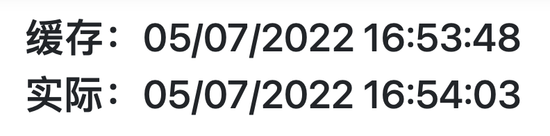

# AOP

环境：MacOS, .NET6 

可用于以下几点
- AuthorizeAttribute 权限认证
- IResourceFilter 资源缓存
- IResultFilter 结果生成前后多拓展
- IActionFilter 方法前后多记录
- IAlwaysRun 响应结果的补充
- IExceptionFilter 异常处理


## IResultFilter

---

ASP.NET 6 提供的是接口`IResourceFilter`  
可通过特写进行自定义拓展  
代码如下：  

```csharp
public class CustomResourceFilterAttribute:Attribute,IResourceFilter
{
    /// <summary>
    /// 在资源执行之前
    /// </summary>
    /// <param name="context"></param>
    public void OnResourceExecuting(ResourceExecutingContext context)
    {
        Console.WriteLine("OnResourceExecuting");
    }

    /// <summary>
    /// 在资源执行之后
    /// </summary>
    /// <param name="context"></param>
    public void OnResourceExecuted(ResourceExecutedContext context)
    {
        Console.WriteLine("OnResourceExecuted");
    }
}
```

执行顺序  
1. `OnResourceExecuting`
2. 控制器的构造函数——实例化控制器
3. 执行Action方法
4. `OnResourceExecuted`

利用执行顺序的特性可用于做缓存  
代码如下：  
```csharp
public class CustomResourceFilterAttribute:Attribute,IResourceFilter
{
    private static Dictionary<string, object> cacheDic = new Dictionary<string, object>();

    /// <summary>
    /// 在资源执行之前
    /// </summary>
    /// <param name="context"></param>
    public void OnResourceExecuting(ResourceExecutingContext context)
    {
        // 请求的路径
        string key = context.HttpContext.Request.Path;
        if (cacheDic.ContainsKey(key))
        {
            context.Result = (IActionResult)cacheDic[key];
        }
        Console.WriteLine("OnResourceExecuting");
    }

    /// <summary>
    /// 在资源执行之后
    /// </summary>
    /// <param name="context"></param>
    public void OnResourceExecuted(ResourceExecutedContext context)
    {
        string key = context.HttpContext.Request.Path;
        cacheDic[key] = context.Result;
        Console.WriteLine("OnResourceExecuted");
    }
}

    //Controller
    [CustomResourceFilter]
    public IActionResult Index()
    {
        ViewBag.now = DateTime.Now.ToString();
        return View();
    }

    // html
    <div class="text-center">
    <h3>缓存：@ViewBag.now</h3>
    <h3>实际：@DateTime.Now.ToString()</h3>
    </div>
```

允许结果如图所示：  


除此之外，还有一个接口`IAsyncResourceFilter`来支持异步  
代码如下：  

```csharp
    public class CustomAsyncResourceFilterAttribute : Attribute, IAsyncResourceFilter
    {
        private static Dictionary<string, object> cacheDic = new Dictionary<string, object>();

        /// <summary>
        /// 当资源执行的时候运行
        /// </summary>
        /// <param name="context"></param>
        /// <param name="next"></param>
        /// <returns></returns>
        /// <exception cref="NotImplementedException"></exception>
        public async Task OnResourceExecutionAsync(ResourceExecutingContext context, ResourceExecutionDelegate next)
        {
            Console.WriteLine("Before");
            // 请求的路径
            string key = context.HttpContext.Request.Path;
            if (cacheDic.ContainsKey(key))
            {
                context.Result = (IActionResult)cacheDic[key];
            }
            else
            {
                // 执行控制器的构造函数和Action方法
                ResourceExecutedContext resource = await next.Invoke();

                // 注意此处为resource
                cacheDic[key] = resource.Result;
                Console.WriteLine("After");
            }
        }
    }
```

## IActionFilter

```csharp
	public class CustomActionFilterAttribute:Attribute, IActionFilter
	{
        /// <summary>
        /// 在Action执行之前
        /// </summary>
        /// <param name="context"></param>
        /// <exception cref="NotImplementedException"></exception>
        public void OnActionExecuting(ActionExecutingContext context)
        {
            Console.WriteLine("OnActionExecuting");
        }

        /// <summary>
        /// 在Action执行之后
        /// </summary>
        /// <param name="context"></param>
        /// <exception cref="NotImplementedException"></exception>
        public void OnActionExecuted(ActionExecutedContext context)
        {
            Console.WriteLine("OnActionExecuted");
        }

    }
```

执行顺序  
1. 控制器的构造函数
2. `OnActionExecuting`
3. Action方法
4. `OnActionExecuted`

利用执行顺序的特性可用于写日志  
代码如下：
```csharp
	public class CustomActionFilterAttribute:Attribute, IActionFilter
	{
        private readonly ILogger<CustomActionFilterAttribute> logger;

        public CustomActionFilterAttribute(ILogger<CustomActionFilterAttribute> logger)
        {
            this.logger = logger;
        }

        /// <summary>
        /// 在Action执行之前
        /// </summary>
        /// <param name="context"></param>
        /// <exception cref="NotImplementedException"></exception>
        public void OnActionExecuting(ActionExecutingContext context)
        {
            var para = context.HttpContext.Request.QueryString.Value;
            var controllerName = context.HttpContext.GetRouteValue("controller");
            var actionName = context.HttpContext.GetRouteValue("action");

            logger.LogInformation($"控制器：{controllerName},方法：{actionName},参数：{para}");
        }

        /// <summary>
        /// 在Action执行之后
        /// </summary>
        /// <param name="context"></param>
        /// <exception cref="NotImplementedException"></exception>
        public void OnActionExecuted(ActionExecutedContext context)
        {
            var result = JsonConvert.SerializeObject(context.Result);
            var controllerName = context.HttpContext.GetRouteValue("controller");
            var actionName = context.HttpContext.GetRouteValue("action");

            logger.LogInformation($"控制器：{controllerName},方法：{actionName},结果为：{result}");
        }
    }

    // 两者皆可
    //[ServiceFilter(typeof(CustomActionFilterAttribute))]
    [TypeFilter(typeof(CustomActionFilterAttribute))]
    public IActionResult Index(int id)
    {
        ViewBag.User = JsonConvert.SerializeObject(new
        {
            Id = id,
            Name = "xx"
        });
        return View();
    }
```

