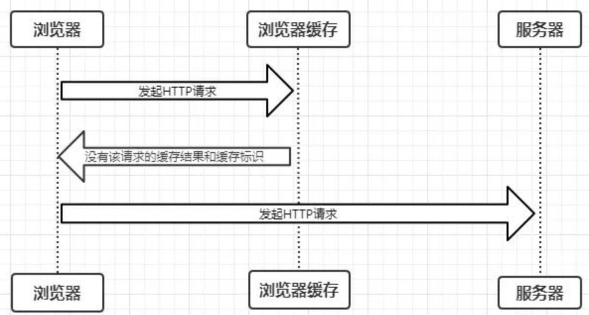
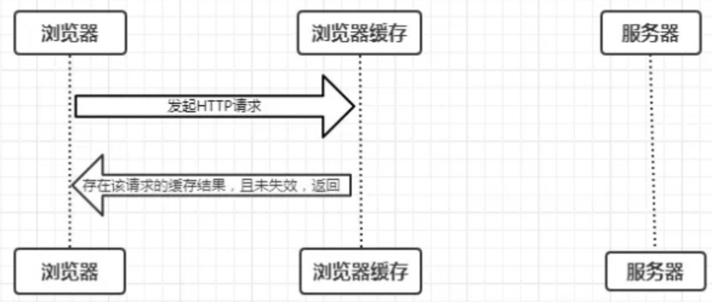

# 客户端缓存

##  缓存机制

---

首先我们来总体感知一下它的匹配流程，如下： 
1. 浏览器发送请求前，根据请求头的`expires`和`cache-control`判断是否命中（包括是否过期）强缓存策略，如果命中，直接从缓存获取资源，并不会发送请求。如果没有命中，则进入下一步。 
2. 没有命中强缓存(不会向服务器发送请求，直接从缓存中读取资源。)规则，浏览器会发送请求，根据请求头的`last-modified`和`etag`判断是否命中协商缓存，如果命中，直接从缓存获取资源。如果没有命中，则进入下一步。 
3. 如果前两步都没有命中，则直接从服务端获取资源。

## 强缓存原理

---

强制缓存就是向浏览器缓存查找该请求结果，并根据该结果的缓存规则来决定是否使用该缓存结果的过程，强制缓存的情况主要有三种(暂不分析协商缓存过程)，如下：

1. 第一次请求，不存在缓存结果和缓存标识，直接向服务器发送请求



2. 存在缓存标识和缓存结果，但是已经失效，强制缓存是啊比，则使用协商缓存（暂不分析）


3. 存在该缓存结果和缓存标识，且该结果尚未失效，强制缓存生效，直接返回该结果



那么强制缓存的缓存规则是什么？ 当浏览器向服务器发起请求时，服务器会将缓存规则放入HTTP响应报文的HTTP头中和请求结果一起返回给浏览器，控制强制缓存的字段分别是`Expires`和`Cache-Control`，其中`Cache-Control`优先级比`Expires`高。

### Expires

---

缓存过期时间，用来指定资源到期的时间，是服务器端的具体的时间点。也就是说，`Expires=max-age + 请求时间`，需要和`Last-modified`结合使用。`Expires`是Web服务器响应消息头字段，在响应http请求时告诉浏览器在过期时间前浏览器可以直接从浏览器缓存取数据，而无需再次请求。

**Tips:** Expires 是 HTTP/1 的产物，受限于本地时间，如果修改了本地时间，可能会造成缓存失效。

### Cache-Control

---

在HTTP/1.1中，`Cache-Control`是最重要的规则，主要用于控制网页缓存，主要取值为： 
- public：所有内容都将被缓存（客户端和代理服务器都可缓存）
- private：所有内容只有客户端可以缓存，`Cache-Control`的默认取值 
- no-cache：客户端缓存内容，但是是否使用缓存则需要经过协商缓存来验证决定 
- no-store：所有内容都不会被缓存，即不使用强制缓存，也不使用协商缓存 
- max-age=xxx (xxx is numeric)：缓存内容将在xxx秒后失效

**Tips:** 需要注意的是，`no-cache`这个名字有一点误导。设置了`no-cache`之后，并不是说浏览器就不再缓存数据，只是浏览器在使用缓存数据时，需要先确认一下数据是否还跟服务器保持一致，也就是协商缓存。而`no-store`才表示不会被缓存，即不使用强制缓存，也不使用协商缓存

### disk cache 和 memory cache

---

细心地同学在开发的时候应该注意到了Chrome的网络请求的Size会出现三种情况`from disk cache`(磁盘缓存)、`from memory cache`(内存缓存)、以及资源大小数值。

| 状态 | 类型 | 说明 |
| --- | --- | --- |
|200| from memory cache | 不请求网络资源，资源在内存中，一般脚本、字体、图片会存在内存当中|
|200|from disk memory|不请求网络资源，在磁盘当中，一般非脚本会存在内存当中，如css等|
|200|资源大小数值|从服务器下载最新资源|
|304|报文大小|请求服务端发现资源没有更新，使用本地资源|

## 协商缓存

---

协商缓存就是强制缓存失效后，浏览器携带缓存标识向服务器发起请求，由服务器根据缓存标识决定是否使用缓存的过程，主要有以下两种情况：

- 协商缓存生效，返回304和Not Modified
- 协商缓存失效，返回200和请求结果

### Last-Modified和If-Modified-Since

---


1. 浏览器首先发送一个请求，让服务端在`response header`中返回请求的资源上次更新时间，就是`last-modified`，浏览器会缓存下这个时间。
2. 然后浏览器再下次请求中，`request header`中带上`if-modified-since`:[`保存的last-modified的值`]。根据浏览器发送的修改时间和服务端的修改时间进行比对，一致的话代表资源没有改变，服务端返回正文为空的响应，让浏览器中缓存中读取资源，这就大大减小了请求的消耗。

由于last-modified依赖的是保存的绝对时间，还是会出现误差的情况：
1. 保存的时间是以秒为单位的，1秒内多次修改是无法捕捉到的；
2. 各机器读取到的时间不一致，就有出现误差的可能性。为了改善这个问题，提出了使用`etag`。

### ETag和If-None-Match

---

`etag`是`http`协议提供的若干机制中的一种Web缓存验证机制，并且允许客户端进行缓存协商。生成`etag`常用的方法包括对资源内容使用抗碰撞散列函数，使用最近修改的时间戳的哈希值，甚至只是一个版本号。 和`last-modified`一样. - 浏览器会先发送一个请求得到`etag`的值，然后再下一次请求在`request header`中带上`if-none-match`:[`保存的etag的值`]。 - 通过发送的`etag`的值和服务端重新生成的`etag`的值进行比对，如果一致代表资源没有改变，服务端返回正文为空的响应，告诉浏览器从缓存中读取资源。

**Tips:** `etag`能够解决`last-modified`的一些缺点，但是`etag`每次服务端生成都需要进行读写操作，而`last-modified`只需要读取操作，从这方面来看，`etag`的消耗是更大的。

二者对比 
- 精确度上：Etag要优于Last-Modified。 
- 优先级上：服务器校验优先考虑Etag。 
- 性能上：Etag要逊于Last-Modified

## 用户行为对浏览器缓存的影响

---

1. 打开网页，地址栏输入地址： 查找 `disk cache` 中是否有匹配。如有则使用；如没有则发送网络请求。
2. 普通刷新 (F5)：因为 TAB 并没有关闭，因此 `memory cache` 是可用的，会被优先使用(如果匹配的话)。其次才是 `disk cache`。
3. 强制刷新 (Ctrl + F5)：浏览器不使用缓存，因此发送的请求头部均带有 `Cache-control`:`no-cache`(为了兼容，还带了 `Pragma`:`no-cache`),服务器直接返回 200 和最新内容。

## 代码

---

环境：MacOS, .NET6 , MVC框架

.NET6对比.NET5没有了Stratup文件,但是配置还是一样的

```csharp
app.UseStaticFiles(
    new StaticFileOptions()
    {
        FileProvider = new PhysicalFileProvider(Path.Combine(Directory.GetCurrentDirectory(),@"wwwroot")),
        OnPrepareResponse = context =>
        {
            context.Context.Response.Headers[HeaderNames.CacheControl] = "public,max-age = 60"; //缓存60秒
        }
    }
    );
```

1. 在中间件中加入缓存的配置。
2. 命令行启动服务`dotnet run --urls=http://localhost:5001/`
3. 首次加载时会发现都是从服务端获取
4. 刷新(F5 / Command + R)后有些文件走的是缓存
5. 强制刷新(Ctrl+F5 / Command + Shift + R)后再次从服务端获取
6. 超过缓存生效时间后再次刷新，若服务器未修改则协商缓存生效，返回304和Not Modified
7. 超过缓存生效时间后再次刷新，若服务器已修改则协商缓存失效，返回200和请求结果
