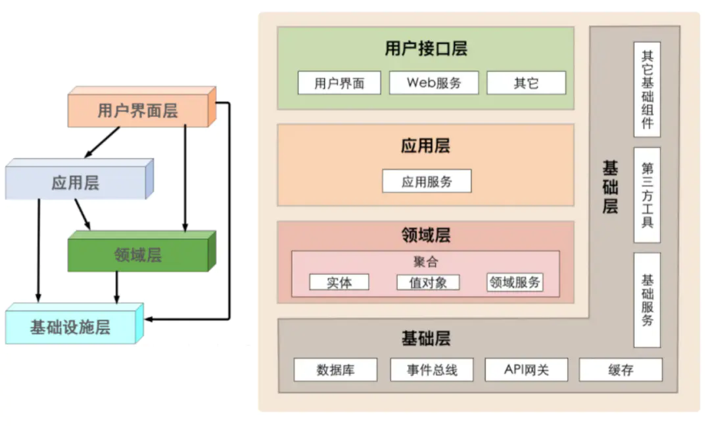

# DDD

## 架构

---

### DDD 分层架构

自上而下：  
- `User Interface`:web 请求，rpc 请求，mq 消息等外部输入均被视为外部输入的请求，可能修改到内部的业务数据。
- `Application Layer`:与 MVC 中的 service 不同的不是，service 中存储着大量业务逻辑。但在应用服务的实现中，它负责编排、转发、校验等。
- `Domain Layer`:或称为模型层，系统的核心，负责表达业务概念，业务状态信息以及业务规则。即包含了该领域所有复杂的业务知识抽象和规则定义。该层主要精力要放在领域对象分析上，可以从实体，值对象，聚合（聚合根），领域服务，领域事件，仓储，工厂等方面入手。
- `Infrastructure Layer`:主要有 2 方面内容，一是为领域模型提供持久化机制，当软件需要持久化能力时候才需要进行规划；一是对其他层提供通用的技术支持能力，如消息通信，通用工具，配置等的实现。

**Tips**:在设计和开发时，不要将本该放在领域层的业务逻辑放到应用层中实现，因为庞大的应用层会使领域模型失焦，时间一长你的服务就会演化为传统的三层架构，业务逻辑会变得混乱。

### 各层数据转换

每一层都有自己特定的数据，可以做如下区分：

- `VO(View Object)`：视图对象，主要对应界面显示的数据对象。对于一个 WEB 页面，或者 SWT、SWING 的一个界面，用一个 VO 对象对应整个界面的值。
- `DTO(Data Transfer Object)`：数据传输对象，主要用于远程调用等需要大量传输对象的地方。比如我们一张表有 100 个字段，那么对应的 PO 就有 100 个属性。但是我们界面上只要显示 10 个字段，客户端用 WEB service 来获取数据，没有必要把整个 PO 对象传递到客户端，这时我们就可以用只有这 10 个属性的 DTO 来传递结果到客户端，这样也不会暴露服务端表结构。到达客户端以后，如果用这个对象来对应界面显示，那此时它的身份就转为 VO。在这里，我泛指用于展示层与服务层之间的数据传输对象。
- `DO(Domain Object)`：领域对象，就是从现实世界中抽象出来的有形或无形的业务实体。
- `PO(Persistent Object)`：持久化对象，它跟持久层（通常是关系型数据库）的数据结构形成一一对应的映射关系，如果持久层是关系型数据库，那么，数据表中的每个字段（或若干个）就对应 PO 的一个（或若干个）属性。最形象的理解就是一个 PO 就是数据库中的一条记录，好处是可以把一条记录作为一个对象处理，可以方便的转为其它对象。

https://www.jianshu.com/p/7086f0ed32ca

https://www.jianshu.com/p/b6ec06d6b594