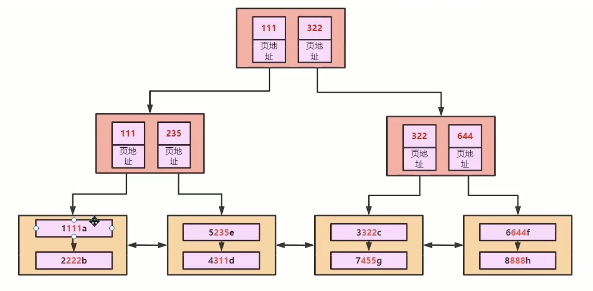
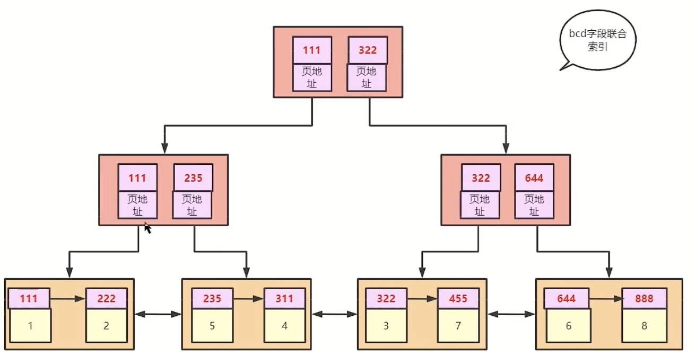
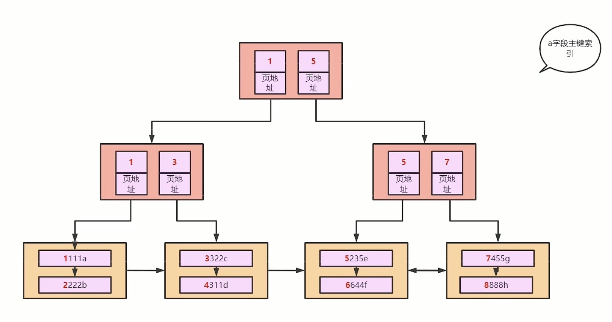

# 为什么要遵循最左前缀原则才能使用索引

首先，建立一个联合索引

```SQL
create index idx_t1_bcd on t1(b,c,d)
```

此时表的默认排序顺序依次为a(主键),b,c,d

若将B+树画为如图所示

此时会发现，数据除了b、c、d的值外还存了e的值，而e的值应该是一个无关的量

所以正确的B+树画法应该是如图

将每一个联合索引对应主键的值，再以回表的形式在主键索引中找到对应的数据

主键索引的B+树如图所示


所以当使用联合索引的时候，索引的判断就像字符串判断一般是自左向右的，因此必须满足最左前缀原则才能使用联合索引。

**Tips**:当执行语句`select c from t1`时会发现也走了索引，因为联合索引存放的数据是不完整，相比于全表扫描，每表能存放的数据会更多而数据总量是相同的，因此找到匹配的数据需要的页数会更少一些。并且，sql语句是自左向右执行的，只有自上而下执行sql时才会要求最左前缀原则。