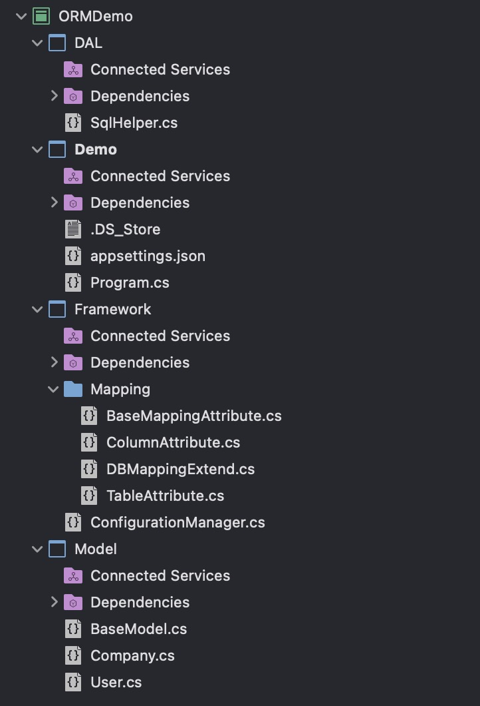

# 简单ORM框架 —— 查询操作

## 项目整体结构

---

开发环境：.Net 6.0, Mysql

项目结构图如下图所示：



## 简单实现（写了再慢慢改）

---

### SqlHelper

```csharp
private static string ConnectionStringCustomers = ConfigurationManager.SqlConnectionStringCustom;

public Company FindCompany(int id)
{
    string sql = $@"SELECT Id,Name,CreateTime,LastModifierId,LastModifyTime From Company
                WHERE Id = {id}";

    using (MySqlConnection conn = new MySqlConnection(ConnectionStringCustomers))
    {
        MySqlCommand command = new MySqlCommand(sql, conn);
        conn.Open();

        var reader = command.ExecuteReader();
        if (reader.Read())
        {
            Company company = new Company()
            {
                Id = (int)reader["Id"],
                Name = reader["Name"].ToString()
            };

            return company;
        }
        else
        {
            return null;
        }
    }
}
```

由代码可见，定义了一个ConfigurationManager方法用于获取数据库连接字符串，通过sql语句直接访问数据库获取数据，这样简单的查询数据库查询就完成了。但是问题也显而易见，首先sql语句被写死，拓展性极差。其次下边的Company类也是写死的，不好维护且编写也费事费力！

### model

此处用到的model如下所示：
```csharp
public class Company : BaseModel
{
    public string Name { get; set; }

    public DateTime CreateTime { get; set; }

    public int CreatorId { get; set; }

    public int? LastModifierId { get; set; }

    public DateTime? LastModifyTime { get; set; }
}

// model基类
public class BaseModel
{
    public int Id { get; set; }
}
```

**Tips**: 为了让数据库上下文有一个统一的约束，此处简单定义了一个model基类

### ConfigurationManager方法

ConfigurationManager方法：

```csharp
	public class ConfigurationManager
	{
		private static string _SqlConnectionStringCustom = null;

		static ConfigurationManager()
		{
			IConfigurationRoot configuration = new ConfigurationBuilder()
				.SetBasePath(Directory.GetCurrentDirectory())
				.AddJsonFile("appsettings.json")
				.Build();
			_SqlConnectionStringCustom = configuration["ConnectionStrings:Customers"];
				
		}

		public static string SqlConnectionStringCustom
        {
            get
            {
				return _SqlConnectionStringCustom;
            }
        }
	}
```
从配置文件appsettings.json中获取链接字符串。
**Tips**: 此处除了要引用`Microsoft.Extensions.Configuration`包以外，还需要引入`Microsoft.Extensions.Configuration.FileExtensions`包和`Microsoft.Extensions.Configuration.Json`包

## 使用泛型

---

代码烂没有问题，但总不能一直烂吧。。。
按现在的逻辑，每有一个model就得写一个方法来实现，这也太折磨人了。所以用个泛型优化一下？

### 修改SqlHelper方法

```csharp
public T Find<T>(int id) where T : BaseModel //泛型约束保证类型正确
{
    Type type = typeof(T);

    // 通过拓展方法获取特性里的名字
    string colunmStrings = string.Join(",", type.GetProperties().Select(x => $"{x.Name}"));

    string sql = $@"SELECT {colunmStrings} From {type.Name} WHERE Id = {id}";

    using (MySqlConnection conn = new MySqlConnection(ConnectionStringCustomers))
    {
        MySqlCommand command = new MySqlCommand(sql, conn);
        conn.Open();

        var reader = command.ExecuteReader();
        if (reader.Read())
        {
            // 创建实体
            T t = Activator.CreateInstance<T>();

            foreach (var prop in type.GetProperties())
            {
                string propName = prop.Name;

                // 空类型转换

                //if (reader[prop.Name] == DBNull.Value)
                //{
                //    prop.SetValue(t, null);
                //}
                //else
                //{
                //    prop.SetValue(t, reader[prop.Name]);
                //}
                prop.SetValue(t, reader[propName] is DBNull ? null : reader[propName]);
            }

            return t;
        }
        else
        {
            return null;
        }
    }
}
```

1. 泛型加上了`BaseModel`的约束，这样就不怕奇奇怪怪的类能调用了！
2. 使用了泛型，这也不管是什么`model`都可以直接调用，一个方法就可以通用，省时又省力，好耶！
3. 既然传入的是泛型，那`sql`就不能写死了，所以通过反射的方法，拿到`model`的属性名，再拼接成字符串。这样sql的前半部分就写完啦
4. 同理，通过反射可以拿到`model`的类名，这样就可以与数据库中的表名一一对应，这样`sql`就能拼接完成。
5. 既然用了泛型，同样的实体也得使用泛型来接受数据，此处有两种方法来创建实体
   1. 通过反射创建实体：`T t = Activator.CreateInstance<T>();`
   2. 在方法上加`new()`约束,这样就可以直接`T t = new T();`
6. 由于model中存在可空类型数据，如果不进行处理会抛类型转换异常。所以此处进行一下判断数据库数据是否为null：`reader[propName] is DBNull ? null : reader[propName]`

到此，SqlHelper就修改的差不多啦。关于sql中的`where`也可以写成动态sql拼接，此处偷懒啦～

## 使用特性

---

考虑到数据库和代码中用到的字段可能会不统一，所以写了个特性方法来处理。

表名特性和字段特性：

```csharp
    [AttributeUsage(AttributeTargets.Class)]
    public class TableAttribute : BaseMappingAttribute
    {
        private string tableName = null;

        public TableAttribute(string tableName) : base(tableName)
        {
            this.tableName = tableName;
        }

        public string GetMappingName()
        {
            return this.tableName;
        }
    }

    [AttributeUsage(AttributeTargets.Property)]
    public class ColumnAttribute
    {
        private string columnName = null;

        public ColumnAttribute(string columnName)
        {
            this.columnName = columnName;
        }

        public string GetMappingName()
        {
            return this.columnName;
        }
    }
```

一个用于约束类，一个用于约束字段，这里不再赘述了。

除此之外，还需要一个拓展方法用于判断是否加了特性

```csharp
public static string GetMappingTableName(this Type type)
{
    if (type.IsDefined(typeof(TableAttribute), true))
    {
        var attribute = type.GetCustomAttribute<TableAttribute>();
        return attribute.GetMappingName();
    }
    else
    {
        return type.Name;
    }
}

public static string GetMappingPropertyName(this PropertyInfo prop)
{
    if (prop.IsDefined(typeof(BaseMappingAttribute), true))
    {
        var attribute = prop.GetCustomAttribute<BaseMappingAttribute>();
        return attribute.GetMappingName();
    }
    else
    {
        return prop.Name;
    }
}
```
**Tips**:如果加了特性，则返回特性标记的Name
此时只需要将SqlHelper中的获取表名或字段名的方式改为拓展方法即可。
例如：
- `Table: x.Name => x.GetMappingTableName()`
- `Column: x.Name => x.GetMappingPropertyName()`

**Tips**:得益于this关键字,拓展方法可以直接如上使用！

特性写完了，但是总感觉有不足，就是代码过于冗杂，上述代码几乎长得都差不多，那要怎么改呢？

抽象出来！首先定义一个父类：
```csharp
    public class BaseMappingAttribute : Attribute
    {
        private string mappingName = null;

        public BaseMappingAttribute(string mappingName)
        {
            this.mappingName = mappingName;
        }

        public string GetMappingName()
        {
            return this.mappingName;
        }
    }
```

这样子类只用继承父类，并调用父类方法即可，如下所示，冗余代码就可以注释掉了
```csharp
[AttributeUsage(AttributeTargets.Property)]
public class ColumnAttribute : BaseMappingAttribute
{
    //private string columnName = null;

    public ColumnAttribute(string columnName) : base(columnName)
    {
        //this.columnName = columnName;
    }

    //public string GetMappingName()
    //{
    //    return this.columnName;
    //}
}

[AttributeUsage(AttributeTargets.Class)]
public class TableAttribute : BaseMappingAttribute
{
    //private string tableName = null;

    public TableAttribute(string tableName) : base(tableName)
    {
        //this.tableName = tableName;
    }

    //public string GetMappingName()
    //{
    //    return this.tableName;
    //}
}

// 拓展方法中的类也可以合并为一个，由于PropertyInfo和Type都继承自MemberInfo类
//所以可以直接使用泛型
public static string GetMappingName<T>(this T t) where T : MemberInfo
{
    if (t.IsDefined(typeof(TableAttribute), true))
    {
        var attribute = t.GetCustomAttribute<TableAttribute>();
        return attribute.GetMappingName();
    }
    else
    {
        return t.Name;
    }
}
```

**Notes**:别忘记了给SqlHelper中的方法都替换成`GetMappingName()`！

到此，查询的操作实现的就差不多了，欲知后事如何，请看下集～