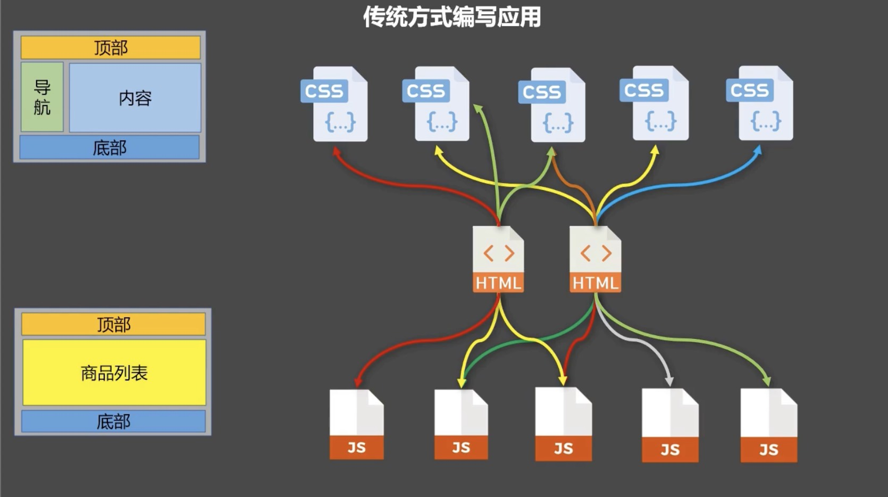
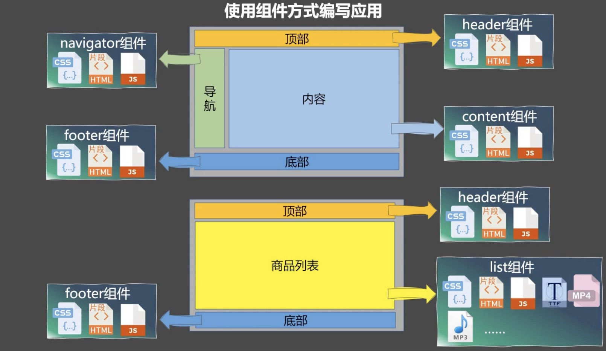

# Vue组件化

**传统方式编写应用**



存在的问题：
1. 依赖关系复杂，不好维护
2. 代码复用率不高
  
**使用组件方式编写应用**



用于实现局部（特定）功能效果的代码集合(`html`,`css`,`js`,`image`等)相比于传统方式等编写，使用组件化可达到代码复用，简化项目，挺高运行效率。

1. 组件名：
   - 一个单词组成：
     1. 首字母小写
     2. 首字母大写
   - 多个单词组成：
     1. `kebab-case`命名：`xx-xx`
     2. `CamelCase`命名：`XxXxxx`（需要Vue脚手架）

   **Tips:**  
   1. 组件名尽量回避HTML中已有的元素名称，如：`h2`,`H2`等
   2. 可以使用`name`配置项指定组件在**开发者工具中**呈现的名字
2. 组件标签：
   1. `<xxx></xxx>`
   2. `<xxx/>`  
   **Tips:** 不使用脚手架时`<xxx/>`会导致后续组件不能渲染
3. 简写方式：`const xxx = Vue.extend(options)` ——> `const xxx = options`


## 非单文件组件

---

一个文件中包含n个组件  

Vue中使用组件等三大步骤：
1. 定义组件（创建组件）
   使用`Vue.extend(options)`创建，其中`options`和`new Vue(options)`时传入的那个`options`几乎一样，但区别如下：
   1. `el`不要写，因为所有组件最终都要经过一个`vm`管理，由`vm`中的`el`决定服务哪个容器
   2. `data`必须写成函数，为了避免组件复用时数据存在饮用关系  
   **Tips:** 使用`template`可以配置组件结构
2. 注册组件
   1. 局部注册：靠`new Vue`时传入`components`选项
   2. 全局注册：靠`Vue.component('组件名',组件)`
3. 使用组件

代码如下：  

```html
<body>
    <div id="root">
        <!-- 3.使用组件 -->
        <school></school>
        <student></student>
        <global></global>
    </div>
</body>
<script type="text/javascript">
    Vue.config.productionTip = false

    // 1. 定义组件 
    const student = Vue.extend({
        template: `
            <div>
                <h3>姓名：{{name}}</h3>
                <h3>年龄：{{age}}</h3>
                <button @click="show">点我</button>
            </div>
        `,
        data() {
            return {
                name: 'xx',
                age: 18
            }
        },
        methods: {
            show(){
                alert(this.name)
            }
        },
    })

    const school = Vue.extend({
        template: `
            <div>
                <h3>学校名：{{name}}</h3>
                <h3>地址：{{address}}</h3>
            </div>
        `,
        data() {
            return {
                name: 'xxSchool',
                address: 'xxPlace'
            }
        }
    })

    const global = Vue.extend({
        template:`
        <h1>hello<h1>
        `
    })

    Vue.component('global',global)

    // 创建Vue实例
    const vm = new Vue({
        el: '#root',
        // 2. 注册组件
        components:{
            student,
            school
        }
    })
</script>
```

## 单文件组件

---

一个文件中只包含1个组件