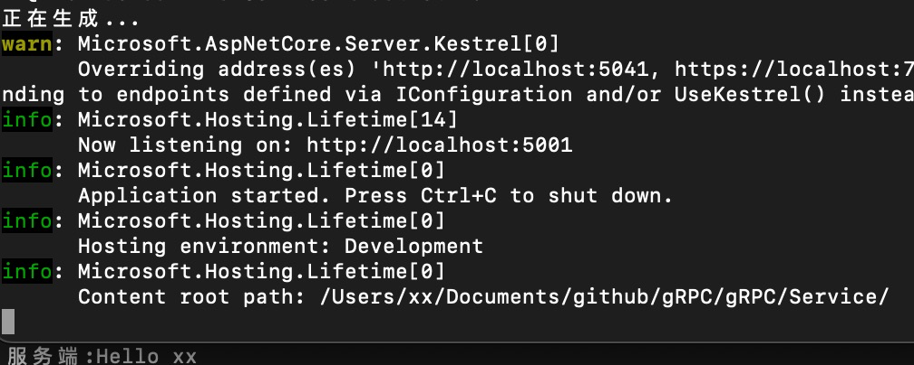
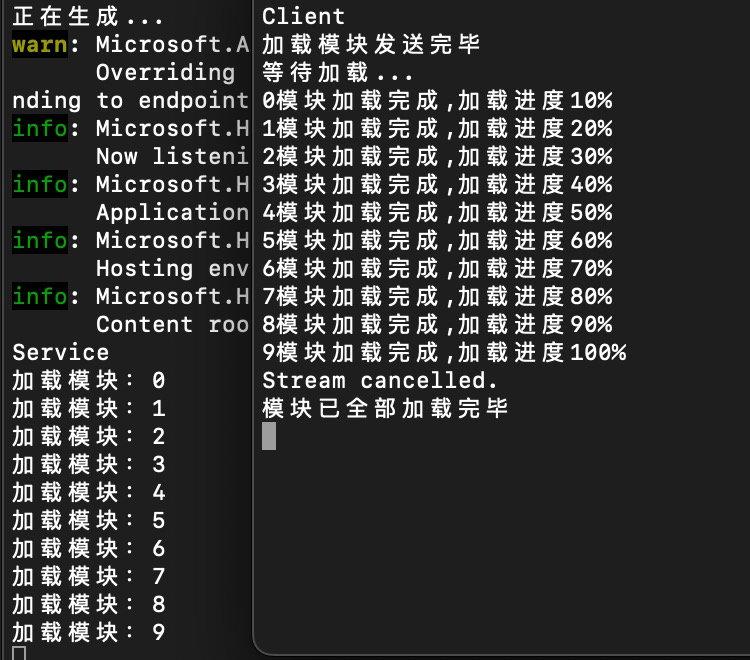

# gRPC

开发环境：macOS(Arm64), .NET6, VS for Mac 2022

gRPC是一款成熟的RPC框架，具有跨语言、支持双向流、Protobuf二进制序列化等优点。  
RPC框架的作用是从一台机器（客户端）上通过参数传递的方式调用另一台机器（服务器）上的一个函数或方法（可以统称为服务）并得到返回的结果，简单来说就是**远程过程调用**。

常用的远程过程调用方式有`REST`、`SOAP`、`RPC`。  
- `REST`基于`HTTP`进行调用，如`GET\POST\PUT`，在浏览器端可直接调用。
- `SOAP`基于`Xml`封装成了`HTTP`协议，在VS中可直接添加服务引用，在浏览器端可直接调用。
- `RPC`可基于`TCP`和`HTTP`通讯，在VS中可直接添加服务引用。

## 搭建

---

### Service端

1. 首先打开VS新建一个`gRPC`项目
2. 进入`Program.cs` 会发现给的模板中有一段官方的注释  
    ```csharp
    // Additional configuration is required to successfully run gRPC on macOS.
    // For instructions on how to configure Kestrel and gRPC clients on macOS, visit https://go.microsoft.com/fwlink/?linkid=2099682
    ```  
    大致意思是如果要在macOS上运行`gPRC`的话得需要一些额外配置，所以我们点进官方文档看一眼。  

        Kestrel 不支持 macOS 和更早的 Windows 版本（如 Windows 7）上的带有 TLS 的 HTTP/2。 默认情况下，ASP.NET Core gRPC 模板和示例使用 TLS。 尝试启动 gRPC 服务器时，你将看到以下错误消息：

        无法绑定到 IPv4 环回接口上的 https://localhost:5001 ：“由于缺少 ALPN 支持，macOS 不支持使用 TLS 的 HTTP/2。
        
        若要解决此问题，请将 Kestrel 和 gRPC 客户端配置为使用不带有 TLS 的 HTTP/2。 应仅在开发过程中执行此操作。 如果不使用 TLS，将会在不加密的情况下发送 gRPC 消息。

        Kestrel 必须在 Program.cs 中配置一个不带 TLS 的 HTTP/2 终结点：

    ```csharp
    public static IHostBuilder CreateHostBuilder(string[] args) =>
        Host.CreateDefaultBuilder(args)
            .ConfigureWebHostDefaults(webBuilder =>
            {
                webBuilder.ConfigureKestrel(options =>
                {
                    // Setup a HTTP/2 endpoint without TLS.
                    options.ListenLocalhost(5001, o => o.Protocols = 
                        HttpProtocols.Http2);
                });
                webBuilder.UseStartup<Startup>();
            });
    ```
    
    可是官方是不是忘记了，在.NET6以后`Startup`已经与`Program.cs`合并到一起了  
    所以正确的配置应该改为如下：
    
    ```csharp
    //在Program.cs中添加一行
    builder.WebHost.ConfigureKestrel(options =>
    {
        // Setup a HTTP/2 endpoint without TLS.
        options.ListenLocalhost(5001, o => o.Protocols =
            HttpProtocols.Http2);
    });
    ```

    保存后，打开终端运行即可。

### Client端

1. 新建一个控制台应用
2. 导入NuGet
   - `Grpc.Net.Client`，其中包含 .NET Core 客户端。
   - `Google.Protobuf` 包含适用于 C# 的 [Protobuf](Protobuf.md) 消息。
   - `Grpc.Tools`，其中包含适用于 Protobuf 文件的 C# 工具支持。 运行时不需要工具包，因此依赖项标记为 PrivateAssets="All"。
3. 将`Service`中的`Protos`文件夹复制到`Client`下
4. 卸载`Client`（Upload Project）
5. 右键`Client`->`工具`->`编辑文件`  
   将代码中的部分修改为如下：
   
   ```csharp
    <ItemGroup>
        // 将Service改为Client
        <Protobuf Include="Protos\greet.proto" GrpcServices="Client" />
    </ItemGroup>
   ```
6. Reload Project
7. 使用以下代码更新 `gRPC`客户端 `Program.cs` 文件  
   
   ```csharp
    using Grpc.Net.Client;
    using Service;

    // 官方文档中此处为https协议，但是macOS不支持，所以只能使用http协议
    using (var channel = GrpcChannel.ForAddress("http://localhost:5001"))
    {
        var client = new Greeter.GreeterClient(channel);
        var reply = await client.SayHelloAsync(new HelloRequest { Name = "xx" });
        Console.WriteLine("服务端:" + reply.Message);
    }
   ```
8. 终端启动，有可能会跑权限异常，只需要在`系统偏好设置`->`安全性与隐私`->`隐私`->`完全磁盘访问权限`中把终端给勾上即可。

**Tips:** 有关[Protobuf](Protobuf.md)点击跳转

运行结果如下：



## gRPC双向流

---

|服务类型|特点|
|---|---|
|简单RPC|一般的RPC调用，传入一个请求参数，返回一个返回对象(前面到请求没有处理完，后面的请求就不会被处理)|
|服务端流式 RPC|传入一个请求对象，服务端可以返回多个结果对象|
|客户端流式 RPC|客户端传入多个请求对象，服务端返回一个结果对象(流式管道，非长连接，解决了部分队头堵塞，但并发量高的话还是可能被阻塞)|
|双向流式 RPC|结合客户端流式RPC和服务端流式RPC，可以传入多个请求对象，返回多个结果对象|

1. 修改`greet.protp`  
    ```csharp
    syntax = "proto3";

    option csharp_namespace = "Service";

    package greet;

    // The greeting service definition.
    service Greeter {
    // Sends a greeting
    rpc SayHello (HelloRequest) returns (HelloReply);
    rpc Bothway(stream ToMessage) returns (stream BackMessage);
    }

    // The request message containing the user's name.
    message HelloRequest {
    string name = 1;
    }

    // The response message containing the greetings.
    message HelloReply {
    string message = 1;
    }

    message ToMessage{
        string message = 1;
    }

    message BackMessage{
        string message = 1;
    }
    ```

    添加了一个Bothway方法，该方法参数为ToMessage，返回BackMessage。使用 `stream` 修饰，声明为流式传输。

2. 实现Bothway
   修改 `GreeterService.cs`，实现`Bothway`方法：
   ```csharp
    /// <summary>
    /// 双向流
    /// </summary>
    /// <param name="requestStream">请求流</param>
    /// <param name="responseStream">响应流</param>
    /// <param name="context">上下文</param>
    /// <returns></returns>
    public override async Task Bothway(IAsyncStreamReader<ToMessage> requestStream, IServerStreamWriter<BackMessage> responseStream, ServerCallContext context)
    {
        while (!context.CancellationToken.IsCancellationRequested && await requestStream.MoveNext())
        {
            string msg = requestStream.Current.Message;
            Console.WriteLine($"加载模块：{msg}");
            await Task.Delay(500);
            if (!context.CancellationToken.IsCancellationRequested)
            {
                await responseStream.WriteAsync(new BackMessage()
                {
                    Message = $"{msg}模块加载完成"
                });
            }
        }
    }
   ```

3. 编写客户端
   ```csharp
    var task = Bothway();
    task.Wait();
    Console.ReadKey();

    async static Task Bothway()
    {
        //发送模块的个数
        const int count = 10;

        //创建Grpc通道
        var channel = GrpcChannel.ForAddress("http://localhost:5001");
        //创建Greeter客户端
        var client = new Greeter.GreeterClient(channel);
        //创建双向流对象
        var bothway = client.Bothway();
        //CancellationTokenSource 管理是否关闭流
        //CancellationTokenSource.CancelAfter() 规定时间关闭流
        //CancellationTokenSource.Cancel() 立即关闭流
        var cts = new CancellationTokenSource();
        //响应事件
        var backTask = Task.Run(async () =>
        {
            int current = 0;
            try
            {
                //从响应流获取数据(cts.Token: 是否关闭流)
                while (await bothway.ResponseStream.MoveNext(cts.Token))
                {
                    current++;
                    var back = bothway.ResponseStream.Current;
                    Console.WriteLine($"{back.Message},加载进度{((double)current / count) * 100}%");
                    if (current >= 10)
                    {
                        //关闭流
                        cts.Cancel();
                    }
                }
            }
            //关闭流异常捕获
            catch (RpcException ex) when (ex.StatusCode == StatusCode.Cancelled)
            {
                Console.WriteLine("Stream cancelled.");
            }
        });

        for (int i = 0; i < count; i++)
        {
            //请求流写入数据
            await bothway.RequestStream.WriteAsync(new ToMessage()
            {
                Message = i.ToString()
            });
        }

        //等待发送完成
        await bothway.RequestStream.CompleteAsync();

        Console.WriteLine("加载模块发送完毕");
        Console.WriteLine("等待加载...");

        //等待响应完成
        await backTask;

        Console.WriteLine("模块已全部加载完毕");
    }
   ```

   运行结果如下：
   

## 身份认证

---

身份认证用于登陆认证、授权等作用，下面将展示如何在gRPC中进行身份认证

### Service端

1. 添加Nuget包: `Microsoft.AspNetCore.Authentication.JwtBearer`
2. 添加身份认证，修改`Service`下的`Program.cs`  
   ```csharp
    //注册身份认证服务
    builder.Services.AddAuthentication(x =>
    {
        x.DefaultAuthenticateScheme = JwtBearerDefaults.AuthenticationScheme;
        x.DefaultChallengeScheme = JwtBearerDefaults.AuthenticationScheme;
    })
    //使用Jwt认证
    .AddJwtBearer(o =>
    {
        o.TokenValidationParameters = new TokenValidationParameters()
        {
            ValidIssuer = "jwttest",
            ValidAudience = "jwttest",
            IssuerSigningKey = new SymmetricSecurityKey(Encoding.UTF8.GetBytes("hello_worldhello_worldhello_worldhello_world")),
        };
    });

    //注册授权服务
    builder.Services.AddAuthorization();
   ```

3. 添加Proto文件,命名为`auth.proto`
   ```csharp
    syntax = "proto3";

    option csharp_namespace = "Service";

    package auth;

    // The greeting service definition.
    service Auth {
    // Sends a greeting
    rpc GetToken (AuthData) returns (AuthResult);
    rpc Test(Empty) returns (Empty);
    }

    // The request message containing the user's name.
    message AuthData {
    string name = 1;
    string pass = 2;
    }

    // The response message containing the greetings.
    message AuthResult {
    int32 code = 1;
    string token = 2;
    string message = 3;
    }

    message Empty{}
   ```

4. 修改Service项目文件
   
   ```csharp
    <!-- 将 greet.proto 替换为 *.proto -->
    <Protobuf Include="Protos\*.proto" GrpcServices="Server" />
   ```
    **Tips:**在添加proto文件后，客户端需重新生成项目，生成proto声明的类

5. 添加`AuthService.cs`类，继承于生成的`Auth.AuthBase`
   ```csharp
    using System;
    using System.IdentityModel.Tokens.Jwt;
    using System.Security.Claims;
    using System.Text;
    using Grpc.Core;
    using Microsoft.AspNetCore.Authorization;
    using Microsoft.IdentityModel.Tokens;

    namespace Service.Services
    {
        public class AuthService : Auth.AuthBase
        {
            //重写GetToken编写认证逻辑
            public override Task<AuthResult> GetToken(AuthData request, ServerCallContext context)
            {
                if (request.Name == "alice" && request.Pass == "alice")
                {
                    var claims = new[] {
                new Claim(ClaimTypes.Name, "alice"),
                new Claim(ClaimTypes.NameIdentifier, "0")
            };
                    var key = new SymmetricSecurityKey(Encoding.UTF8.GetBytes("hello_worldhello_worldhello_worldhello_world"));
                    var creds = new SigningCredentials(key, SecurityAlgorithms.HmacSha256);
                    var token = new JwtSecurityToken(
                        issuer: "jwttest",
                        audience: "jwttest",
                        claims: claims,
                        notBefore: DateTime.UtcNow,
                        expires: DateTime.UtcNow.AddSeconds(10),
                        signingCredentials: creds);
                    var stoken = new JwtSecurityTokenHandler().WriteToken(token);
                    return Task.FromResult(new AuthResult()
                    {
                        Code = 1,
                        Message = "success",
                        Token = stoken
                    });
                }
                return Task.FromResult(new AuthResult()
                {
                    Code = -1,
                    Message = "用户名或密码错误"
                });
            }

            //添加Authorize测试认证
            [Authorize]
            public override Task<Empty> Test(Empty request, ServerCallContext context)
            {
                var user = context.GetHttpContext().User;
                Console.WriteLine(user.Identity.Name);
                return Task.FromResult(new Empty());
            }
        }
    }
   ```

6. 注册授权服务并添加认证,`app.MapGrpcService<AuthService>();`
   
### Client端

由于macOS没配置https协议，所以无法测试，代码如下。

```csharp
var channel = GetAuthGrpcChannel();
var task = AuthTest(channel);
task.Wait();

/// <summary>
/// 获取已身份认证的GrpcChannel
/// </summary>
static GrpcChannel GetAuthGrpcChannel()
{
    var channel = GrpcChannel.ForAddress("http://localhost:5001");
    var authClient = new Auth.AuthClient(channel);
    //获取Token
    var token = authClient.GetToken(new AuthData()
    {
        Name = "xx",
        Pass = "xx"
    });
    channel.Dispose();
    //创建Authorization证书
    var credentials = CallCredentials.FromInterceptor((context, metadata) =>
    {
        if (!string.IsNullOrEmpty(token.Token))
        {
            metadata.Add("Authorization", $"Bearer {token.Token}");
        }
        return Task.CompletedTask;
    });
    //创建具有Token的通道
    var auth_channel = GrpcChannel.ForAddress("http://localhost:5001", new GrpcChannelOptions()
    {
        Credentials = ChannelCredentials.Create(new SslCredentials(), credentials)
    });
    return auth_channel;
}

/// <summary>
/// 测试身份认证
/// </summary>
/// <param name="invoker"></param>
/// <returns></returns>
static async Task AuthTest(GrpcChannel channel)
{
    Console.WriteLine("AuthTest");
    var authClient = new Auth.AuthClient(channel);
    await authClient.TestAsync(new Empty());
    Console.WriteLine("AuthSuccess");
}
```