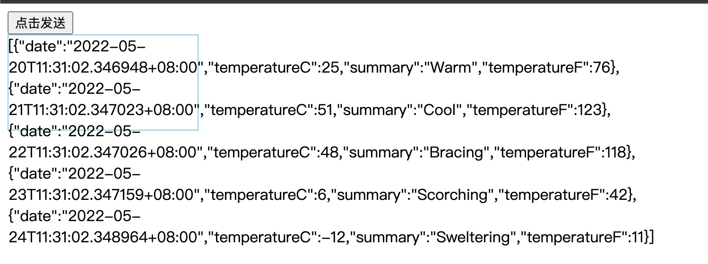

# Ajax

AJAX = Asynchronous JavaScript and XML（异步的 JavaScript 和 XML）。  
AJAX 最大的优点是在不重新加载整个页面的情况下，可以与服务器交换数据并更新部分网页内容。  
AJAX 不需要任何浏览器插件，但需要用户允许JavaScript在浏览器上执行。  
AJAX 不是新的编程语言，而是一种使用现有标准的新方法。

优点：
1. 不重新加载整个页面的情况下，可以与服务器交换数据并更新部分网页内容。 
2. 允许根据用户事件来更新部分页面内容

缺点：
1. 没有浏览历史，不能回退
2. 存在跨域问题（同源）
3. SEO不友好

## XML

---

XML 指可扩展标记语言（EXtensible Markup Language）   
XML 标签没有被预定义。您需要自行定义标签。  
XML 是一种标记语言，很类似 HTML，但不同的是HTML中都是预定义标签，而XML中没有预定义标签，全都是自定义标签，用来表示一些数据。    
XML 的设计宗旨是传输和存储数据，而非显示数据  
XML 被设计为具有自我描述性。  

## XMLHttpRequest请求

---

环境：
- 客户端：`XMLHttpRequest`
- 服务端：.NET6 MiniAPI


### GET 请求

以下为Get请求的代码

```html
<!DOCTYPE html>
<html lang="en">

<head>
    <meta charset="UTF-8">
    <meta http-equiv="X-UA-Compatible" content="IE=edge">
    <meta name="viewport" content="width=device-width, initial-scale=1.0">
    <title>Get</title>
    <style>
        #result {
            width: 200px;
            height: 100px;
            border: solid 1px skyblue;
        }
    </style>
</head>

<body>
    <button>点击发送</button>
    <div id="result"></div>

    <script>
        // 获取button元素
        const btn = document.getElementsByTagName('button')[0];
        const result = document.getElementById("result");
        btn.onclick = function () {
            // 创建对象
            const xhr = new XMLHttpRequest()
            // 初始化，设置请求方法和url
            xhr.open('GET', 'http://localhost:5038/weatherforecast')
            // 注意！一定要加！
            xhr.withCredentials = true;
            // 发送
            xhr.send()
            // 事件绑定，处理服务端返回的结果
            xhr.onreadystatechange = function () {
                if (xhr.readyState === 4) {
                    if (xhr.status >= 200 && xhr.status < 300) {
                        // console.log(xhr.status)
                        // console.log(xhr.statusText)
                        // console.log(xhr.getAllResponseHeaders())
                        // console.log(xhr.response)

                        result.innerHTML = xhr.response;

                        // 对JSON格式进行转化
                        // result.innerHTML = JSON.parse(xhr.response);
                    }
                }
            }
        }
    </script>
</body>

</html>
```

**Tips:** 如果需要添加参数，则在`open`方法的路径后边添加`?a=100&b=200`

新建一个新的MiniApi,用自带的get请求就好，然后添加以下配置即可
```csharp
// 配置跨域
builder.Services.AddCors(options =>
{
    options.AddPolicy(name: "Policy1", builder =>
    {
        builder.
        WithOrigins("http://127.0.0.1:5500").
        // 跟上方一样，很重要！
        AllowCredentials().
        AllowAnyMethod().
        AllowAnyHeader();
    });
});

app.UseCors("Policy1");
```

请求结果如下


### POST 请求

与Get请求内容大致一致，代码如下：

```html
<!DOCTYPE html>
<html lang="en">

<head>
    <meta charset="UTF-8">
    <meta http-equiv="X-UA-Compatible" content="IE=edge">
    <meta name="viewport" content="width=device-width, initial-scale=1.0">
    <title>Post</title>
    <style>
        #result {
            width: 200px;
            height: 100px;
            border: solid 1px skyblue;
        }
    </style>
</head>

<body>
    <div id="result"></div>

    <script>
        const result = document.getElementById("result");
        result.addEventListener("mouseover",function () {
            // 创建对象
            const xhr = new XMLHttpRequest()
            // 初始化，设置请求方法和url
            xhr.open('POST', 'http://localhost:5038/post')
            xhr.withCredentials = true;
            // 发送
            xhr.send()
            // 事件绑定，处理服务端返回的结果
            xhr.onreadystatechange = function () {
                if (xhr.readyState === 4) {
                    if (xhr.status >= 200 && xhr.status < 300) {
                        result.innerHTML = xhr.response;
                    }
                }
            }
        })
    </script>
</body>

</html>
```

**Tips:** 如果需要添加参数，则在`send`方法的路径后边添加`'a=100&b=200'`

在服务端中添加Post方法

```csharp
app.MapPost("/post", () => "Hello POST");
```

### 超时与网络异常处理

```javascript
const xhr = new XMLHttpRequest()
// 超时设置两秒
xhr.timeout=2000
// 超时回调
xhr.ontimeout = function(){
    alert("网络异常，请稍后重试")
}
// 网络异常
xhr.onerror = function(){
    alert("网络异常")
}
```

## JQuery请求

---

首先引入js文件`<script crossorigin="anonymous" src="https://cdn.bootcdn.net/ajax/libs/jquery/3.6.0/jquery.js"></script>`  
可以访问bootcdn获取相应的资源

### Get

```html
<!DOCTYPE html>
<html lang="en">
<head>
    <meta charset="UTF-8">
    <meta http-equiv="X-UA-Compatible" content="IE=edge">
    <meta name="viewport" content="width=device-width, initial-scale=1.0">
    <title>JQuery发送AJAX请求</title>
    <script crossorigin="anonymous" src="https://cdn.bootcdn.net/ajax/libs/jquery/3.6.0/jquery.js"></script>
</head>
<body>
    <div class="container">
        <h2 class="page-header">JQuery发送AJAX请求</h2>
        <button class="btn btn-primary">GET</button>
        <button class="btn btn-danger">POST</button>
        <button class="btn btn-info">通用型AJAX</button>
    </div>
    <script>
        $('button').eq(0).click(function(){
            $.get('http://localhost:5038/weatherforecast',{a:100,b:200},function(data){
                console.log(data)
            })
        })
    </script>
</body>
</html>
```

post请求只需修改为如下即可
```javascript
$('button').eq(1).click(function(){
    $.post('http://localhost:5038/post',{a:100,b:200},function(data){
        console.log(data)
    })
})
```

若要对JSON格式进行转化则在get方法中加入`'json'`即可

```javascript
$('button').eq(0).click(function(){
    $.get('http://localhost:5038/json',{a:100,b:200},function(data){
        console.log(data)
    },'json')
})
```

## 通用方法发送请求

```javascript
$('button').eq(2).click(function(){
    $.ajax({
        // url
        url:'http://localhost:5038/json',
        // 参数
        data:{a:100,b:200},
        // 请求类型
        type:'GET',
        // 响应体结果
        dataType:'json',
        // 超时时间
        timeout: 3000,
        // 成功的回调
        success:function(result){
            console.log(result)
        },
        // 错误的回调
        error:function(){
            console.log('出错啦！')
        },
        // 头信息
        headers:{
            c:300,
            d:400
        }
    })
})
```