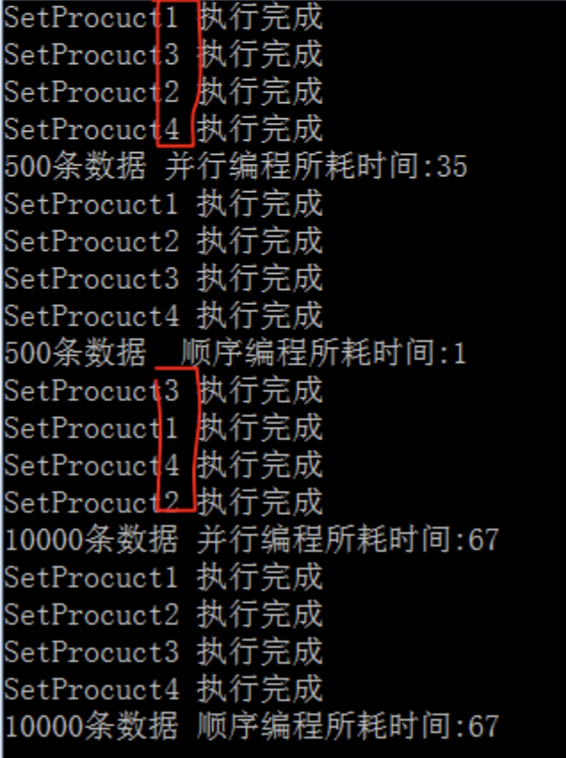
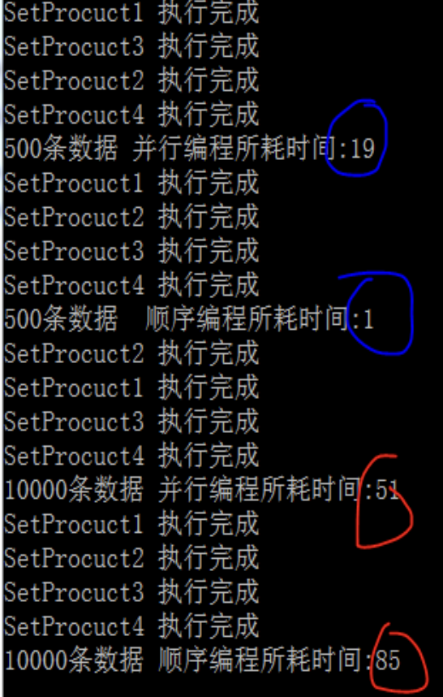
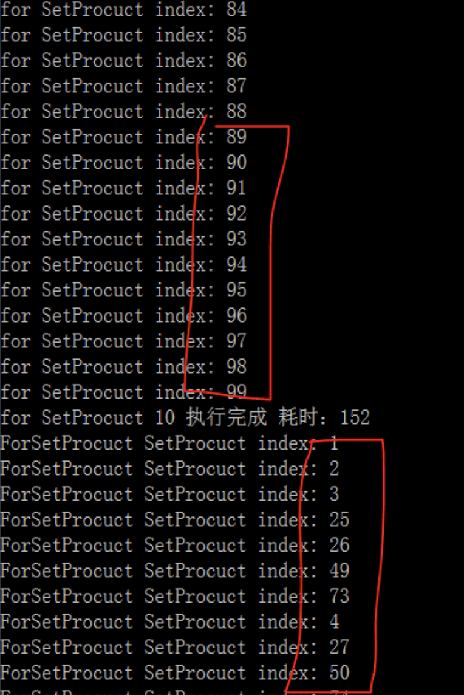

# Parallel

TPL中引入了一个新命名空间`System.Threading.Tasks`,在该命名空间下Task是主类，表示一个类的异步的并发的操作，创建并行代码的时候不一定要直接使用Task类，在某些情况下可以直接使用`Parallel`静态类`(System.Threading.Tasks.Parallel)`下所提供的方法，而不用底层的Task实例。

## Parallel.Invoke

---

试图将很多方法并行运行，如果传入的是4个方法，则至少需要4个逻辑内核才能足以让这4个方法并发运行，逻辑内核也称为硬件线程。

需要注意的是：  
1. 即使拥有4个逻辑内核，也不一定能够保证所需要运行的4个方法能够同时启动运行，如果其中的一个内核处于繁忙状态，那么底层的调度逻辑可能会延迟某些方法的初始化执行。
2. 通过`Parallel.Invoke`编写的并发执行代码一定不能依赖与特定的执行顺序，因为它的并发执行顺序也是不定的。
3. 使用`Parallel.Invoke`方法一定要测量运行结果、实现加速比以及逻辑内核的使用率，这点很重要。
4. 使用`Parallel.Invoke`，在运行并行方法前都会产生一些额外的开销，如分配硬件线程等。

好处：这是一种并行运行很多方法的简单方式，使用`Parallel.Invoke`，不需要考虑任务和线程的问题。

```csharp
class Program
    {
        private static List<Product> ProductList = null;
        /*  
         *  没有特定的执行顺序
         *  示例中 基于电脑配置 采用了4个方法的并行编程
         *  Parallel.Invoke 首先会尝试并行启动4个方法，充分利用一个或多个物理处理器所提供的多个逻辑内核
         *  但是在实际的并行执行中，至少要有4个逻辑内核才能满足4个方法的并行运行
         *  如果有个或者多个逻辑内核处于繁忙状态，那么底层的调度逻辑可能会延迟某些方法的初始化执行
         *  通过Parallel.Invoke编写的并发执行代码一定不能依赖与特定的执行顺序，因为它的并发执行顺序也是不定的。
         */
        static void Main(string[] args)
        {
            ProductList = new List<Product>();
            Thread.Sleep(3000);
            Stopwatch swTask = new Stopwatch();
            swTask.Start();
            /*执行并行操作*/
            Parallel.Invoke(SetProcuct1_500, SetProcuct2_500, SetProcuct3_500, SetProcuct4_500);
            swTask.Stop();
            Console.WriteLine("500条数据 并行编程所耗时间:" + swTask.ElapsedMilliseconds);

            ProductList = new List<Product>();

            Thread.Sleep(3000);/*防止并行操作 与 顺序操作冲突*/

            Stopwatch sw = new Stopwatch();
            sw.Start();
            SetProcuct1_500();
            SetProcuct2_500();
            SetProcuct3_500();
            SetProcuct4_500();
            sw.Stop();
            Console.WriteLine("500条数据  顺序编程所耗时间:" + sw.ElapsedMilliseconds);

            ProductList = new List<Product>();

            Thread.Sleep(3000);

            swTask.Restart();
            /*执行并行操作*/
            Parallel.Invoke(() => SetProcuct1_10000(), () => SetProcuct2_10000(), () => SetProcuct3_10000(), () => SetProcuct4_10000());
            swTask.Stop();
            Console.WriteLine("10000条数据 并行编程所耗时间:" + swTask.ElapsedMilliseconds);

            ProductList = new List<Product>();
            Thread.Sleep(3000);
            sw.Restart();
            SetProcuct1_10000();
            SetProcuct2_10000();
            SetProcuct3_10000();
            SetProcuct4_10000();
            sw.Stop();
            Console.WriteLine("10000条数据 顺序编程所耗时间:" + sw.ElapsedMilliseconds);

            Console.ReadLine();
        }
        private static void SetProcuct1_500()
        {
            for (int index = 1; index < 500; index++)
            {
                Product model = new Product();
                model.Category = "Category" + index;
                model.Name = "Name" + index;
                model.SellPrice = index;
                ProductList.Add(model);
            }
            Console.WriteLine("SetProcuct1 执行完成");
        }
        private static void SetProcuct2_500()
        {
            for (int index = 500; index < 1000; index++)
            {
                Product model = new Product();
                model.Category = "Category" + index;
                model.Name = "Name" + index;
                model.SellPrice = index;
                ProductList.Add(model);
            }
            Console.WriteLine("SetProcuct2 执行完成");
        }
        private static void SetProcuct3_500()
        {
            for (int index = 1000; index < 2000; index++)
            {
                Product model = new Product();
                model.Category = "Category" + index;
                model.Name = "Name" + index;
                model.SellPrice = index;
                ProductList.Add(model);
            }
            Console.WriteLine("SetProcuct3 执行完成");
        }
        private static void SetProcuct4_500()
        {
            for (int index = 2000; index < 3000; index++)
            {
                Product model = new Product();
                model.Category = "Category" + index;
                model.Name = "Name" + index;
                model.SellPrice = index;
                ProductList.Add(model);
            }
            Console.WriteLine("SetProcuct4 执行完成");
        }
        private static void SetProcuct1_10000()
        {
            for (int index = 1; index < 20000; index++)
            {
                Product model = new Product();
                model.Category = "Category" + index;
                model.Name = "Name" + index;
                model.SellPrice = index;
                ProductList.Add(model);
            }
            Console.WriteLine("SetProcuct1 执行完成");
        }
        private static void SetProcuct2_10000()
        {
            for (int index = 20000; index < 40000; index++)
            {
                Product model = new Product();
                model.Category = "Category" + index;
                model.Name = "Name" + index;
                model.SellPrice = index;
                ProductList.Add(model);
            }
            Console.WriteLine("SetProcuct2 执行完成");
        }
        private static void SetProcuct3_10000()
        {
            for (int index = 40000; index < 60000; index++)
            {
                Product model = new Product();
                model.Category = "Category" + index;
                model.Name = "Name" + index;
                model.SellPrice = index;
                ProductList.Add(model);
            }
            Console.WriteLine("SetProcuct3 执行完成");
        }
        private static void SetProcuct4_10000()
        {
            for (int index = 60000; index < 80000; index++)
            {
                Product model = new Product();
                model.Category = "Category" + index;
                model.Name = "Name" + index;
                model.SellPrice = index;
                ProductList.Add(model);
            }
            Console.WriteLine("SetProcuct4 执行完成");
        }
    }

    class Product
    {
        public string Name { get; set; }

        public string Category { get; set; }

        public int SellPrice { get; set; }
    }
```

运行结果如下：  


图中我们可以看出利用 Parallel.Invoke编写的并发执行代，它的并发执行顺序也是不定的。
但是所执行的时间上比不采用并行编程所耗的时间差不多。  
这是因为我们在并行编程中操作了共享资源 ProductList ，如果我把代码做出以下修改，采用并行编程的好处就显现出来了。

```csharp
class Program
    { 
        /*  
         *  没有特定的执行顺序
         *  示例中 基于电脑配置 采用了4个方法的并行编程
         *  Parallel.Invoke 首先会尝试并行启动4个方法，充分利用一个或多个物理处理器所提供的多个逻辑内核
         *  但是在实际的并行执行中，至少要有4个逻辑内核才能满足4个方法的并行运行
         *  如果有个或者多个逻辑内核处于繁忙状态，那么底层的调度逻辑可能会延迟某些方法的初始化执行
         *  通过Parallel.Invoke编写的并发执行代码一定不能依赖与特定的执行顺序，因为它的并发执行顺序也是不定的。
         */
        static void Main(string[] args)
        { 
            Thread.Sleep(3000);
            Stopwatch swTask = new Stopwatch();
            swTask.Start();
            /*执行并行操作*/
            Parallel.Invoke(SetProcuct1_500, SetProcuct2_500, SetProcuct3_500, SetProcuct4_500);
            swTask.Stop();
            Console.WriteLine("500条数据 并行编程所耗时间:" + swTask.ElapsedMilliseconds);
             
            Thread.Sleep(3000);/*防止并行操作 与 顺序操作冲突*/
            Stopwatch sw = new Stopwatch();
            sw.Start();
            SetProcuct1_500();
            SetProcuct2_500();
            SetProcuct3_500();
            SetProcuct4_500();
            sw.Stop();
            Console.WriteLine("500条数据  顺序编程所耗时间:" + sw.ElapsedMilliseconds);
             
            Thread.Sleep(3000);
            swTask.Restart();
            /*执行并行操作*/
            Parallel.Invoke(() => SetProcuct1_10000(), () => SetProcuct2_10000(), () => SetProcuct3_10000(), () => SetProcuct4_10000());
            swTask.Stop();
            Console.WriteLine("10000条数据 并行编程所耗时间:" + swTask.ElapsedMilliseconds);
             
            Thread.Sleep(3000);
            sw.Restart();
            SetProcuct1_10000();
            SetProcuct2_10000();
            SetProcuct3_10000();
            SetProcuct4_10000();
            sw.Stop();
            Console.WriteLine("10000条数据 顺序编程所耗时间:" + sw.ElapsedMilliseconds);

            Console.ReadLine();
        }
        private static void SetProcuct1_500()
        {
            List<Product> ProductList = new List<Product>();
            for (int index = 1; index < 500; index++)
            {
                Product model = new Product();
                model.Category = "Category" + index;
                model.Name = "Name" + index;
                model.SellPrice = index;
                ProductList.Add(model);
            }
            Console.WriteLine("SetProcuct1 执行完成");
        }
        private static void SetProcuct2_500()
        {
            List<Product> ProductList = new List<Product>();
            for (int index = 500; index < 1000; index++)
            {
                Product model = new Product();
                model.Category = "Category" + index;
                model.Name = "Name" + index;
                model.SellPrice = index;
                ProductList.Add(model);
            }
            Console.WriteLine("SetProcuct2 执行完成");
        }
        private static void SetProcuct3_500()
        {
            List<Product> ProductList = new List<Product>();
            for (int index = 1000; index < 2000; index++)
            {
                Product model = new Product();
                model.Category = "Category" + index;
                model.Name = "Name" + index;
                model.SellPrice = index;
                ProductList.Add(model);
            }
            Console.WriteLine("SetProcuct3 执行完成");
        }
        private static void SetProcuct4_500()
        {
            List<Product> ProductList = new List<Product>();
            for (int index = 2000; index < 3000; index++)
            {
                Product model = new Product();
                model.Category = "Category" + index;
                model.Name = "Name" + index;
                model.SellPrice = index;
                ProductList.Add(model);
            }
            Console.WriteLine("SetProcuct4 执行完成");
        }
        private static void SetProcuct1_10000()
        {
            List<Product> ProductList = new List<Product>();
            for (int index = 1; index < 20000; index++)
            {
                Product model = new Product();
                model.Category = "Category" + index;
                model.Name = "Name" + index;
                model.SellPrice = index;
                ProductList.Add(model);
            }
            Console.WriteLine("SetProcuct1 执行完成");
        }
        private static void SetProcuct2_10000()
        {
            List<Product> ProductList = new List<Product>();
            for (int index = 20000; index < 40000; index++)
            {
                Product model = new Product();
                model.Category = "Category" + index;
                model.Name = "Name" + index;
                model.SellPrice = index;
                ProductList.Add(model);
            }
            Console.WriteLine("SetProcuct2 执行完成");
        }
        private static void SetProcuct3_10000()
        {
            List<Product> ProductList = new List<Product>();
            for (int index = 40000; index < 60000; index++)
            {
                Product model = new Product();
                model.Category = "Category" + index;
                model.Name = "Name" + index;
                model.SellPrice = index;
                ProductList.Add(model);
            }
            Console.WriteLine("SetProcuct3 执行完成");
        }
        private static void SetProcuct4_10000()
        {
            List<Product> ProductList = new List<Product>();
            for (int index = 60000; index < 80000; index++)
            {
                Product model = new Product();
                model.Category = "Category" + index;
                model.Name = "Name" + index;
                model.SellPrice = index;
                ProductList.Add(model);
            }
            Console.WriteLine("SetProcuct4 执行完成");
        }
    }

    class Product
    {
        public string Name { get; set; }

        public string Category { get; set; }

        public int SellPrice { get; set; }
    }
```
我将每个方法中的资源隔离，性能显而易见。  


但是在操作500条数据时，显然采用并行操作并不明智，并行所带来的损耗比较大，在实际的开发中，还是要注意下是否有必要进行并行编程。

## Parallel.For

---

将for循环替换成`Parallel.For`，并采用适合这个新方法的参数，就可以对这个已有的for循环进行重构，使其能够充分利用并行化优势。  

需要注意的是：  
1. `Parallel.For`不支持浮点数的步进，使用的是Int32或Int64，每一次迭代的时候加1
2. 由于循环体是并行运行，去迭代执行的顺序无法保证

```csharp
class Program
    {
        static void Main(string[] args)
        {
            Thread.Sleep(3000);
            ForSetProcuct_100();

            Thread.Sleep(3000);
            ParallelForSetProcuct_100();
            Console.ReadLine();
        }
        private static void ForSetProcuct_100()
        {
            Stopwatch sw = new Stopwatch();
            sw.Start();
            List<Product> ProductList = new List<Product>();
            for (int index = 1; index < 100; index++)
            {
                Product model = new Product();
                model.Category = "Category" + index;
                model.Name = "Name" + index;
                model.SellPrice = index;
                ProductList.Add(model);
                Console.WriteLine("for SetProcuct index: {0}", index);
            }
            sw.Stop();
            Console.WriteLine("for SetProcuct 10 执行完成 耗时：{0}", sw.ElapsedMilliseconds);
        }
        private static void ParallelForSetProcuct_100()
        {
            Stopwatch sw = new Stopwatch();
            sw.Start();
            List<Product> ProductList = new List<Product>();
            Parallel.For(1, 100, index =>
            {

                Product model = new Product();
                model.Category = "Category" + index;
                model.Name = "Name" + index;
                model.SellPrice = index;
                ProductList.Add(model);
                Console.WriteLine("ForSetProcuct SetProcuct index: {0}", index);
            });
            sw.Stop();
            Console.WriteLine("ForSetProcuct SetProcuct 20000 执行完成 耗时：{0}", sw.ElapsedMilliseconds);
        }
    }

    class Product
    {
        public string Name { get; set; }

        public string Category { get; set; }

        public int SellPrice { get; set; }
    }
```



由图知，使用Parallel.For所迭代的顺序是无法保证的。

## Parallel.ForEach

---

`Parallel.ForEach`提供一个并行处理一组数据的机制，可以利用一个范围的整数作为一组数据，然后通过一个自定义的分区器将这个范围转换为一组数据块，每一块数据都通过循环的方式进行处理，而这些循环式并行执行的。

```csharp
class Program
    {
        /*  coder:释迦苦僧*/
        static void Main(string[] args)
        {
            List<Product> ProductList =GetProcuctList();
            Parallel.ForEach(ProductList, (model) => {
                Console.WriteLine(model.Name);
            });
            Console.ReadLine();
        }
        private static List<Product> GetProcuctList()
        { 
            List<Product> result = new List<Product>();
            for (int index = 1; index < 100; index++)
            {
                Product model = new Product();
                model.Category = "Category" + index;
                model.Name = "Name" + index;
                model.SellPrice = index;
                result.Add(model);
            }
            return result;
        } 
    }

    class Product
    {
        public string Name { get; set; }

        public string Category { get; set; }

        public int SellPrice { get; set; }
    }
```

## ParallelLoopState

---

`ParallelLoopState`该实例提供了以下两个方法用于停止 `Parallel.For`，`Parallel.ForEach`

- **Break** 这个方法告诉并行循环应该在执行了当前迭代后尽快地停止执行。吐过调用Break时正在处理迭代100，那么循环仍然会处理所有小于100的迭代。
- **Stop** 这个方法告诉并行循环应该尽快停止执行，如果调用Stop时迭代100正在被处理，那么循环无法保证处理完所有小于100的迭代

```csharp
class Program
    {
        static void Main(string[] args)
        {
            
            List<Product> productList = GetProcuctList_500();
            Thread.Sleep(3000);
            Parallel.For(0, productList.Count, (i, loopState) =>
            {
                if (i < 100)
                {
                    Console.WriteLine("采用Stop index:{0}", i);
                }
                else
                {
                    /* 满足条件后 尽快停止执行，无法保证小于100的索引数据全部输出*/
                    loopState.Stop();
                    return;
                }
            });
     
            Thread.Sleep(3000);
            Parallel.For(0, productList.Count, (i, loopState) =>
            {
                if (i < 100)
                {
                    Console.WriteLine("采用Break index:{0}", i);
                }
                else
                {
                    /* 满足条件后 尽快停止执行，保证小于100的索引数据全部输出*/
                    loopState.Break();
                    return;
                }
            });

            Thread.Sleep(3000);
            Parallel.ForEach(productList, (model, loopState) =>
            {
                if (model.SellPrice < 10)
                {
                    Console.WriteLine("采用Stop index:{0}", model.SellPrice);
                }
                else
                {
                    /* 满足条件后 尽快停止执行，无法保证满足条件的数据全部输出*/
                    loopState.Stop();
                    return;
                }
            });
            Thread.Sleep(3000);
            Parallel.ForEach(productList, (model, loopState) =>
            {
                if (model.SellPrice < 10)
                {
                    Console.WriteLine("采用Break index:{0}", model.SellPrice);
                }
                else
                {
                    /* 满足条件后 尽快停止执行，保证满足条件的数据全部输出*/
                    loopState.Break();
                    return;
                }
            });

            Console.ReadLine();
        }
        private static List<Product> GetProcuctList_500()
        {
            List<Product> result = new List<Product>();
            for (int index = 1; index < 500; index++)
            {
                Product model = new Product();
                model.Category = "Category" + index;
                model.Name = "Name" + index;
                model.SellPrice = index;
                result.Add(model);
            }
            return result;
        }
    }
```