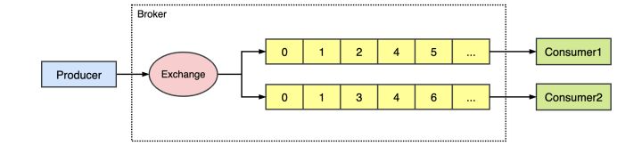

# RabbitMQ

RabbitMQ——Rabbit Message Queue的简写，但不能仅仅理解其为消息队列，消息代理更合适。RabbitMQ 是一个由 Erlang 语言开发的AMQP（高级消息队列协议）的开源实现，其内部结构如下：


RabbitMQ作为一个消息代理，主要和消息打交道，负责接收并转发消息。  
RabbitMQ提供了可靠的消息机制、跟踪机制和灵活的消息路由，支持消息集群和分布式部署。适用于排队算法、秒杀活动、消息分发、异步处理、数据同步、处理耗时任务、CQRS等应用场景。  
下面我们先来看看其内部结构中出现的角色承担者的作用：

- **Producer：生产者**  
  生产者创建消息，然后发布到RabbitMQ中。消息一般可以包含2个部分：`消息体`和`标签（Label）`。消息体也可以称之为payload，在实际应用中，消息体一般是一个带有业务逻辑结构的数据，比如一个JSON字符串。当然可以进一步对这个消息体进行序列化操作。消息的标签用来表述这条消息，比如一个交换器的名称和一个路由键。

- **Consumer：消费者**  
  消费者连接到RabbitMQ服务器，并订阅到队列上。当消费者消费一条消息时，只是消费消息的消息体（payload）。在消息路由的过程中，消息的标签会丢弃，存入到队列中的消息只有消息体，也就不知道消息的生产者是谁。

- **Broker：消息中间件的服务节点**  
  对于RabbitMQ来说，一个RabbitMQ Broker可以简单地看作一个RabbitMQ服务节点，或者RabbitMQ服务实例。大多数情况下也可以将一个RabbitMQ Broker看作一台RabbitMQ服务器。

- **Queue：队列，是RabbitMQ的内部对象，用于存储消息**  
  RabbitMQ中消息都只能存储在队列中，多个消费者可以订阅同一个队列，这时队列中的消息会被平均分摊（Round-Robin，即轮询）给多个消费者进行处理，而不是每个消费者都收到所有的消息并处理，如图  
  
  
```csharp
//声明一个队列
channel.QueueDeclare(queueName, false, false, false, null);
```

- **Exchange：交换器**  
  RabbitMQ中生产者将消息发送到Exchange（交换器，通常也可以用大写的“X”来表示），由交换器将消息路由到一个或者多个队列中。如果路由不到，或许会返回给生产者，或许直接丢弃。  
    RabbitMQ有4种交换器：
    - Direct exchange
    - Fanout exchange
    - Topic exchange
    - Headers exchange
    
其中前3者比较常用  
后面会通过代码分别演示这几个交换器的用法
```csharp
//创建一个非持久化的、非自动删除的、绑定类型为direct的交换器
channel.ExchangeDeclare(exchangeName, ExchangeType.Direct, false, false, null);
```

- **Binding：绑定**  
  RabbitMQ中通过绑定将交换器与队列关联起来，在绑定的时候一般会指定一个Key，告诉RabbitMQ如何正确地将消息路由到队列


```csharp
//将队列与交换机绑定
channel.QueueBind(queueName, exchangeName, routeKey);
```

- **Connection：连接**  
  表示到消息代理的真实 TCP 连接

- **Channel：信道**  
多路复用连接中的一条独立的双向数据流通道，可读可写。
Channel是我们与RabbitMQ打交道的最重要的一个接口，我们大部分的业务操作都是在Channel这个接口中完成的，包括定义Queue、Exchange、绑定Queue与Exchange、发布消息等等。在我们进行这些操作之前我们都需要与RabbitMQ建立一个Connection（Connection 表示到消息代理的真实 TCP 连接），但是如果每次访问RabbitMQ都需要建立Connection的话，在消息量大的时候建立TCP Connection的开销无疑也是巨大的，效率也比较低。这时候Channel起了作用。Channel是Connection中的虚拟连接（AMPQ连接），Channel可以复用Connection的TCP连接，当每个信道的流量不是很大时，复用单一的Connection可以在产生性能瓶颈的情况下有效地节省TCP连接资源。但是当信道的流量很大时，这时候多个信道复用一个Connection就会产生性能瓶颈，就需要开辟多个Connection，将这些信道均摊到这些Connection中。

- **Virtual Host：虚拟主机**  
当我们配置好本地环境后使用账号密码guest、guest登录时就是在访问默认的VHost（"/"）了。
RabbitMQ中的资源权限是针对每个Virtual Host的，用户没有全局权限，只有一个或多个的Virtual Host权限。每一个Virtual Host就相当于一个小型的RabbitMQ服务器，拥有自己的交换机、队列、绑定等、拥有自己的一套权限机制。VHost之间是相互独立的，它既能将同一个RabbitMQ的众多客户区分开来，又可以避免队列和交换器的命名冲突。

## 环境搭建

---

本文主要在MacOS(ARM)平台基于.Net 6 使用VS2022进行Demo演示，其中RabbitMQ部署在Docker上


```shell
# 运行RabbitMQ
 docker run \
--name RabbitMQ \
-p 15672:15672 \
-p 5672:5672 \
-d \
rabbitmq

# 开启管理界面
docker exec -it mq /bin/bash  
rabbitmq-plugins enable rabbitmq_management
```

部署完成以后访问`http://localhost:15672`进入管理界面  
默认用户名`guest`，密码`guest`

打开VS  
1. 新建两个控制台项目，分别为`Consumer`和`Productor`
2. 导入NuGet包`RabbitMQ.Client`

## RabbitMQ消息模型

---

### 1.基本消费模型


P：生产者。一个发送消息的用户应用程序  
C：消费者。消费和接收有类似的意思，消费者是一个主要用来等待接收消息的用户应用程序
中间的框是一个队列：一个 RabbitMQ 代表消费者保存的消息缓冲区。 

生产者
```csharp
using RabbitMQ.Client;
using System.Text;

//创建连接工厂
ConnectionFactory factory = new ConnectionFactory
{
    UserName = "guest",
    Password = "guest",
    HostName = "localhost"
};

//创建连接
using(var connection = factory.CreateConnection())
{
    //创建通道
    using(var channel = connection.CreateModel())
    {
        //声明一个队列
        channel.QueueDeclare("hello", false, false, false, null);

        //如果未声明交换机，则队列会自动绑定到默认direct类型到交换机，并以队列的形式作为路由键
        Console.WriteLine("RabbitMQ连接成功,请输入消息，输入exit退出！");

        string input;
        do
        {
            input = Console.ReadLine();

            var sendBytes = Encoding.UTF8.GetBytes(input);
            //发布消息
            channel.BasicPublish("", "hello", null, sendBytes);
        } while (input.Trim().ToLower() != "exit");
    }
}

```

消费者
```csharp
using RabbitMQ.Client;
using RabbitMQ.Client.Events;
using System.Text;

//创建连接工厂
ConnectionFactory factory = new ConnectionFactory
{
    UserName = "guest",
    Password = "guest",
    HostName = "localhost"
};

//创建链接
using (var connection = factory.CreateConnection())
{
    //创建通道
    using (var channel = connection.CreateModel())
    {
        //事件基本消费者
        EventingBasicConsumer consumer = new EventingBasicConsumer(channel);

        //接收到消息事件
        consumer.Received += (ch, ea) =>
        {
            var message = Encoding.UTF8.GetString(ea.Body.ToArray());
            System.Console.WriteLine($"收到消息：{message}");

            //确认消息已被消费
            channel.BasicAck(ea.DeliveryTag, false);
        };

        //启动消费者，设置为手动应答消息
        channel.BasicConsume("hello", false, consumer);
        Console.WriteLine("消费者已启动");
    }
}
```

启动程序  
打开终端，切换到代码所在文件夹后输入`dotnet run`即可

### 2.Work消息模型

在工人之间分配任务（工作队列或者竞争消费者模式）


此消息模型的好处在于如果你积压了任务，我们只需要添加更多的工作者就可以了。默认情况下，RabbitMQ 会按顺序将每条消息发送给下一个消费者。平均而言，每个消费者都会收到相同数量的消息。这种分发消息的方式称为循环（循环调度）。

只需要在简单模型的基础上再加一个消费者即可。  
循环调度的结果如下：  


**Tips:**
看上去很简单，但是在实际情况可能会出现各种情况，比如：  
1. 工作者完成一项任务可能需要几秒钟。如果其中一个消费者开始一项长期任务并且只完成了部分任务而死去会发生什么。
2. 如果消费者在没有发送 ack 的情况下死亡（其通道关闭、连接关闭或 TCP 连接丢失）RabbitMQ将会做什么处理。
3. 当RabbitMQ遇到异常情况退出或崩溃时，我们的任务会怎么办，只能丢失吗？在重新启动RabbitMQ的时候能重新找回来吗？
4. 当我们有两个工人的情况下，当所有奇数消息很重而偶数消息都很轻时，一个工人将一直很忙，另一个工人几乎不做任何工作。这种情况要怎么处理呢。

其实上面这几种情况RabbitMQ都有解决方案  
（1、2）消息确认  
（3）消息持久性  
（4）公平调度

### 3.Subscribe模型

RabbitMQ 中消息传递模型的核心思想是**生产者向交换器发送消息，从不直接向队列发送任何消息。**实际上，生产者通常根本不知道消息是否会被传递到任何队列。而交换器，一方面它接收来自生产者的消息，另一方面它将它们推送到队列中，交换必须确切地知道如何处理它收到的消息。


RabbitMQ 给我们提供了3种常用的交换器类型:  
**direct**：定向，把消息交给符合指定routing key 的队列  
**topic**：通配符，把消息交给符合routing pattern（路由模式） 的队列  
**fanout**：广播，将消息交给所有绑定到交换机的队列  

**Tips**:Exchange（交换机）只负责转发消息，不具备存储消息的能力，因此如果没有任何队列与Exchange绑定，或者没有符合路由规则的队列，那么消息会丢失！

#### Direct


在这个设置中，我们可以看到绑定了两个队列的直接交换X。第一个队列使用绑定键orange进行绑定，第二个队列有两个绑定，一个使用绑定键black，另一个使用green。
在这样的设置中，使用路由键橙色发布到交换的消息 将被路由到队列Q1。带有黑色 或绿色路由键的消息将发送到Q2。所有其他消息将被丢弃。

根据上方例子我们可以发现所有发送到Direct Exchange的消息被转发到具有指定RouteKey的Queue。在这种模式下消息传递时，RouteKey必须完全匹配，才会被队列接收，否则该消息会被抛弃。

我们之前的代码示例没有定义交换器，默认就是使用了Direct 交换器。  
现在我们重新定义一个Direct 交换器的生产者  
然后跟上面图例一样声明两个队列，使用不同routeKey分别将队列与交换器绑定

生产者代码如下：
```csharp
    //创建通道
    using (var channel = connection.CreateModel())
    {
        var exchangeName = "direct_exchange";

        // 声明第一个队列
        channel.QueueDeclare("hello1", false, false, false, null);
        // 声明第二个队列
        channel.QueueDeclare("hello2", false, false, false, null);
        #region QueueDeclare方法注释
        // queue: 队列的名称
        // durable: 是否设置持久化，持久化的队列会存盘，在服务器重启的时候可以保证不丢失相关信息
        // exclusive: 设置是否排他
        // autoDelete: 设置是否自动删除，自动删除的前提，至少有一个消费者连接这个队列，之后所有与这个队列连接的消费者都断开时才会删除
        // arguments: 设置队列的一些其他参数，如x - message - ttl,x - expires,x - max - length -bytes等
        #endregion

        // 创建一个非持久化的、非自动删除的、绑定类型为Direct的交换器
        channel.ExchangeDeclare(exchangeName, ExchangeType.Direct, false, false, null);
        #region ExchangeDeclare方法注释
        // exchange: 交换机的名称
        // type: 交换机的类型，如fanout,direct,topic
        // durable: 是否设置持久化，持久化的队列会存盘，在服务器重启的时候可以保证不丢失相关信息
        // autoDelete: 设置是否自动删除，自动删除的前提，至少有一个消费者连接这个队列，之后所有与这个队列连接的消费者都断开时才会删除
        // internal: 设置是否是内置的，客户端程序无法直接发送消息到这个交换机中，只能通过交换器路由到交换器这种方式
        // arguments: 其他结构化参数
        #endregion


        // 将队列与交换机绑定
        channel.QueueBind("hello1", exchangeName, "orange");
        channel.QueueBind("hello2", exchangeName, "green");
        channel.QueueBind("hello2", exchangeName, "black");

        Console.WriteLine("RabbitMQ连接成功,请输入消息，输入exit退出！");
        string input;
        do
        {
            input = Console.ReadLine();

            var sendBytes = Encoding.UTF8.GetBytes(input);
            //发布消息
            channel.BasicPublish(exchangeName, "orange", null, sendBytes);
        } while (input.Trim().ToLower() != "exit");
    }
```

运行后发现，消息只会被与`orange`绑定的`hello1`接收

#### Fanout

fanout的路由机制（广播）如下图，即发送到 fanout 类型exchange的消息都会分发到所有绑定该exchange的队列上去。


生产者代码改为如下
```csharp
    var exchangeName = "fanout_exchange";
    var queueName1 = "hello1";
    var queueName2 = "hello2";
    string routeKey = "";

    // 声明第一个队列
    channel.QueueDeclare(queueName1, false, false, false, null);
    // 声明第二个队列
    channel.QueueDeclare(queueName2, false, false, false, null);

    // 创建一个非持久化的、非自动删除的、绑定类型为Direct的交换器
    channel.ExchangeDeclare(exchangeName, ExchangeType.Fanout, false, false, null);

    // 将队列与交换机绑定
    channel.QueueBind(queueName1, exchangeName, routeKey);
    channel.QueueBind(queueName2, exchangeName, routeKey);

    Console.WriteLine("RabbitMQ连接成功,请输入消息，输入exit退出！");
    string input;
    do
    {
        input = Console.ReadLine();

        var sendBytes = Encoding.UTF8.GetBytes(input);
        //发布到指定exchange，fanout类型无需指定routingKey
        channel.BasicPublish(exchangeName, "", null, sendBytes);
    } while (input.Trim().ToLower() != "exit");
}
```

#### Topic

发送到主题交换的消息不能有任意的 routing_key - 它必须是单词列表，由点分隔。这些词可以是任何东西，但通常它们指定与消息相关的一些特征。一些有效的路由键示例："stock.usd.nyse "、"nyse.vmw "、"quick.orange.rabbit "。路由键中可以有任意多的单词，最多为 255 个字节。  
绑定键也必须采用相同的格式。主题交换背后的逻辑 类似于直接交换- 使用特定路由键发送的消息将被传递到与匹配绑定键绑定的所有队列。但是，绑定键有两个重要的特殊情况：

- `*`可以只替换一个单词。
- `#`可以代替零个或多个单词。


在这个例子中，我们将发送所有描述动物的消息。消息将使用由三个单词（两个点）组成的路由键发送。路由键中的第一个词将描述速度，第二个是颜色，第三个是物种：".. "。  
我们创建了三个绑定：Q1 与绑定键".orange. "绑定，Q2 与" ..rabbit "和" lazy.# "绑定。
这些绑定可以概括为：  
Q1 对所有橙色动物都感兴趣。  
Q2 想听听关于兔子的一切，以及关于懒惰动物的一切。  
路由键设置为" quick.orange.rabbit "的消息将被传递到两个队列。消息" lazy.orange.elephant "也将发送给他们两个。另一方面，"quick.orange.fox "只会进入第一个队列，而"lazy.brown.fox "只会进入第二个队列。"lazy.pink.rabbit "只会被传递到第二个队列一次，即使它匹配两个绑定。" quick.brown.fox " 不匹配任何绑定，因此将被丢弃。  
如果我们违反合同并发送带有一四个单词的消息，例如" orange "或" quick.orange.male.rabbit "，会发生什么？好吧，这些消息不会匹配任何绑定并且会丢失。  
另一方面，"lazy.orange.male.rabbit "，即使它有四个单词，也会匹配最后一个绑定，并被传递到第二个队列。

Topic Exchange使用起来非常灵活，它可以通过使用通配符（*与#）来进行模糊匹配（跟我们Api中的模糊查询类似），所有发送到Topic Exchange的消息被转发到能和Topic匹配的Queue上  
看一下匹配规则：  

- `*`匹配一个单词
- `#`匹配一个或多个单词

如：  
`xx.*`只可以匹配到`xx.rabbit`格式的routingKey
`xx.#`则可以匹配到`xx.male.rabbit`格式的routingKey

代码如下
```csharp
    var exchangeName = "topic_exchange";
    var queueName1 = "hello1";
    string routeKey = "routeKey.*";

    // 声明第一个队列
    channel.QueueDeclare(queueName1, false, false, false, null);

    // 创建一个非持久化的、非自动删除的、绑定类型为Direct的交换器
    channel.ExchangeDeclare(exchangeName, ExchangeType.Topic, false, false, null);

    // 将队列与交换机绑定
    channel.QueueBind(queueName1, exchangeName, routeKey);

    Console.WriteLine("RabbitMQ连接成功,请输入消息，输入exit退出！");
    string input;
    do
    {
        input = Console.ReadLine();

        var sendBytes = Encoding.UTF8.GetBytes(input);
        //发布到指定exchange，fanout类型无需指定routingKey
        channel.BasicPublish(exchangeName, "routeKey.one", null, sendBytes);
    } while (input.Trim().ToLower() != "exit");
}
```