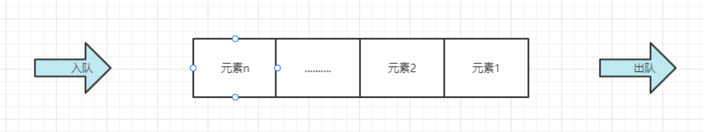
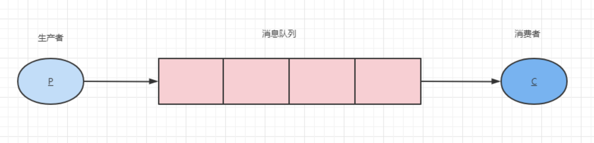

# 消息队列

## 什么是消息队列？

---

**消息（Message）**：是指在应用之间传送的数据，消息可以非常简单，比如只包含文本字符串，也可以更复杂，可能包含嵌入对象。  
**队列**：可以说是一个数据结构，可以存储数据，如下图，我们从右侧（队尾）插入元素（入队），从队头获取元素（出队）。 
 
**消息队列（Message Queue）**：一种应用间的通信方式，消息发送后可以立即返回，有消息系统来确保信息的可靠专递，消息发布者只管把消息发布到MQ中而不管谁来取，消息使用者只管从MQ中取消息而不管谁发布的，这样发布者和使用者都不用知道对方的存在。

## 为什么要使用消息队列？

---

消息队列主要解决了以下问题：
- **应用耦合**：多应用间通过消息队列对同一消息进行处理，避免调用接口失败导致整个过程失败
- **异步处理**：多应用对消息队列中同一消息进行处理，应用间并发处理消息，相比串行处理，减少处理时间
- **限流削峰**：广泛应用于秒杀或抢购活动中，避免流量过大导致应用系统挂掉的情况

[RabbitMQ](RabbitMQ.md)