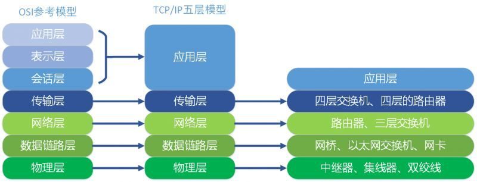

# OSI七层模型

OSI是一种开放系统互连参考模型 (Open System Interconnect 简称OSI），是国际标准化组织(ISO)和国际电报电话咨询委员会(CCITT)联合制定的开放系统互连参考模型，为开放式互连信息系统提供了一种功能结构的框架。

它从低到高分别是：物理层、数据链路层、网络层、传输层、会话层、表示层、应用层。

## 物理层

---

### 定义

物理层为设备之间的数据通信提供传输媒体及互连设备，为数据传输提供可靠的环境。

物理层的媒体包括架空明线、平衡电缆、光纤、无线信道等。通信用的互连设备指`DTE`和`DCE`间的互连设备。
- `DTC`: 数据终端设备，又称物理设备，如计算机、终端等都包括在内。
- `DCE`: 数据通信设备或电路连接设备，如调制解调器等。

数据传输通常是经过`DTE` —> `DCE`，再经过`DCE` —> `DTE`的路径。  
互连设备指将`DTE`、`DCE`连接起来的装置，如各种插头、插座。LAN中的各种粗、细同轴电缆、T型接、插头，接收器，发送器，中继器等都属物理层的媒体和连接器。

### 主要功能

为数据端设备提供传送数据的通路，数据通路可以是一个物理媒体，也可以是多个物理媒体连接而成。一次完整的数据传输，包括激活物理连接，传送数据，终止物理连接。所谓激活，就是不管有多少物理媒体参与，都要在通信的两个数据终端设备间连接起来，形成一条通路。

传输数据.物理层要形成适合数据传输需要的实体，为数据传送服务。一是要保证数据能在其上正确通过，二是要提供足够的带宽(带宽是指每秒钟内能通过的比特(BIT)数)，以减少信道上的拥塞。传输数据的方式能满足点到点，一点到多点，串行或并行，半双工或全双工，同步或异步传输的需要。

## 数据链路层

---

### 定义

数据链路可以粗略地理解为数据通道。物理层要为终端设备间的数据通信提供传输媒体及其连接.媒体是长期的,连接是有生存期的.在连接生存期内,收发两端可以进行不等的一次或多次数据通信.每次通信都要经过建立通信联络和拆除通信联络两过程.这种建立起来的数据收发关系就叫作数据链路.而在物理媒体上传输的数据难免受到各种不可靠因素的影响而产生差错,为了弥补物理层上的不足,为上层提供无差错的数据传输,就要能对数据进行检错和纠错.数据链路的建立,拆除,对数据的检错,**纠错**是数据链路层的基本任务。

### 主要功能

链路层是为网络层提供数据传送服务的,这种服务要依靠本层具备的功能来实现。链路层应具备如下功能:
- 链路连接的建立，拆除，分离。
- 帧定界和帧同步（链路层的数据传输单元是帧,协议不同,帧的长短和界面也有差别，但无论如何必须对帧进行定界）
- 顺序控制,指对帧的收发顺序的控制。
- 差错检测和恢复
- 还有链路标识,流量控制等等.差错检测多用方阵码校验和循环码校验来检测信道上数据的误码,而帧丢失等用序号检测.各种错误的恢复则常靠反馈重发技术来完成。

### 主要协议

数据链路层协议是为发对等实体间保持一致而制定的,也为了顺利完成对网络层的服务。主要协议如下：
- `ISO1745--1975`:"数据通信系统的基本型控制规程".这是一种面向字符的标准,利用10个控制字符完成链路的建立，拆除及数据交换.对帧的收发情况及差错恢复也是靠这些字符来完成.`ISO1155`, `ISO1177`, `ISO2626`, `ISO2629`等标准的配合使用可形成多种链路控制和数据传输方式.
- `ISO3309--1984`:称为"HDLC 帧结构".`ISO4335--1984`:称为"HDLC 规程要素 "。
- `ISO7809--1984`:称为"HDLC 规程类型汇编"。这3个标准都是为面向比特的数据传输控制而制定的。有人习惯上把这3个标准组合称为高级链路控制规程.
- `ISO7776`:称为"DTE数据链路层规程".与CCITT X.25LAB"平衡型链路访问规程"相兼容。

## 网络层

---

### 定义

网络层的产生也是网络发展的结果.在联机系统和线路交换的环境中，网络层的功能没有太大意义.当数据终端增多时。它们之间有中继设备相连.此时会出现一台终端要求不只是与唯一的一台而是能和多台终端通信的情况,这就是产生了把任意两台数据终端设备的数据链接起来的问题,也就是路由或者叫寻径。另外,当一条物理信道建立之后,被一对用户使用,往往有许多空闲时间被浪费掉.人们自然会希望让多对用户共用一条链路，为解决这一问题就出现了逻辑信道技术和虚拟电路技术。

### 主要功能

网络层为建立网络连接和为上层提供服务,应具备以下主要功能：
- 路由选择和中继
- 激活,终止网络连接
- 在一条数据链路上复用多条网络连接,多采取分时复用技术 
- 差错检测与恢复
- 排序,流量控制
- 服务选择
- 网络管理

## 传输层

---

### 定义

传输层是两台计算机经过网络进行数据通信时,第一个端到端的层次，具有缓冲作用。当网络层服务质量不能满足要求时，它将服务加以提高，以满足高层的要求；当网络层服务质量较好时，它只用很少的工作。传输层还可进行复用，即在一个网络连接上创建多个逻辑连接。

### 主要功能

传输层只存在于端开放系统中,是介于低3层通信子网系统和高3层之间的一层,但是很重要的一层.因为它是源端到目的端对数据传送进行控制从低到高的最后一层.  
有一个既存事实，即世界上各种通信子网在性能上存在着很大差异.例如电话交换网,分组交换网,公用数据交换网，局域网等通信子网都可互连,但它们提供的吞吐量,传输速率,数据延迟通信费用各不相同.对于会话层来说,却要求有一性能恒定的界面.传输层就承担了这一功能.它采用分流/合流，复用/解复用技术来调节上述通信子网的差异,使会话层感受不到.  
此外传输层还要具备差错恢复，流量控制等功能,以此对会话层屏蔽通信子网在这些方面的细节与差异.传输层面对的数据对象已不是网络地址和主机地址,而是和会话层的界面端口.上述功能的最终目的是为会话提供可靠的,无误的数据传输.传输层的服务一般要经历传输连接建立阶段,数据传送阶段,传输连接释放阶段3个阶段才算完成一个完整的服务过程.而在数据传送阶段又分为一般数据传送和加速数据传送两种。传输层服务分成5种类型.基本可以满足对传送质量,传送速度,传送费用的各种不同需要.

## 会话层

---

### 定义

会话层提供的服务可使应用建立和维持会话，并能使会话获得同步。会话层使用校验点可使通信会话在通信失效时从校验点继续恢复通信。这种能力对于传送大的文件极为重要。会话层,表示层,应用层构成开放系统的高3层，面对应用进程提供分布处理，对话管理,信息表示,恢复最后的差错等.  
会话层同样要担负应用进程服务要求，而运输层不能完成的那部分工作,给运输层功能差距以弥补.主要的功能是对话管理，数据流同步和重新同步。要完成这些功能,需要由大量的服务单元功能组合,已经制定的功能单元已有几十种。

### 主要功能

为会话实体间建立连接。  
为给两个对等会话服务用户建立一个会话连接,应该做如下几项工作：  
- 将会话地址映射为运输地址
- 选择需要的运输服务质量参数(QOS)
- 对会话参数进行协商
- 识别各个会话连接
- 传送有限的透明用户数据

### 数据传输阶段

这个阶段是在两个会话用户之间实现有组织的,同步的数据传输.用户数据单元为SSDU,而协议数据单元为SPDU.会话用户之间的数据传送过程是将SSDU转变成SPDU进行的.

## 表示层

---

### 定义

表示层是为异种机通信提供一种公共语言，以便能进行互操作。这种类型的服务之所以需要，是因为不同的计算机体系结构使用的数据表示法不同。例如，IBM主机使用EBCDIC编码，而大部分PC机使用的是ASCII码。在这种情况下，便需要会话层来完成这种转换。

### 功能

通过前面的介绍,我们可以看出,会话层以下5层完成了端到端的数据传送,并且是可靠,无差错的传送.但是数据传送只是手段而不是目的,最终是要实现对数据的使用.由于各种系统对数据的定义并不完全相同,最易明白的例子是键盘,其上的某些键的含义在许多系统中都有差异.这自然给利用其它系统的数据造成了障碍.表示层和应用层就担负了消除这种障碍的任务.  

对于用户数据来说,可以从两个侧面来分析,一个是数据含义被称为语义,另一个是数据的表示形式,称做语法.像文字,图形,声音,文种,压缩,加密等都属于语法范畴.表示层设计了3类15种功能单位,其中上下文管理功能单位就是沟通用户间的数据编码规则,以便双方有一致的数据形式,能够互相认识.ISO表示层为服务,协议,文本通信符制定了DP8822,DP8823,DIS6937/2等一系列标准.

## 应用层

---

### 定义

应用层向应用程序提供服务，这些服务按其向应用程序提供的特性分成组，并称为服务元素。有些可为多种应用程序共同使用，有些则为较少的一类应用程序使用。

### 主要功能

应用层是开放系统的最高层,是直接为应用进程提供服务的。其作用是在实现多个系统应用进程相互通信的同时,完成一系列业务处理所需的服务.其服务元素分为两类:公共应用服务元素CASE和特定应用服务元素SASE.CASE提供最基本的服务,它成为应用层中任何用户和任何服务元素的用户，主要为应用进程通信,分布系统实现提供基本的控制机制.特定服务SASE则要满足一些特定服务,如文卷传送,访问管理,作业传送,银行事务,订单输入等.  

这些将涉及到虚拟终端,作业传送与操作,文卷传送及访问管理,远程数据库访问,图形核心系统,开放系统互连管理等等.应用层的标准有DP8649"公共应用服务元素",DP8650"公共应用服务元素用协议",文件传送,访问和管理服务及协议.